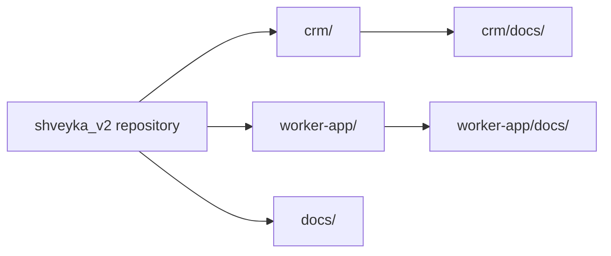
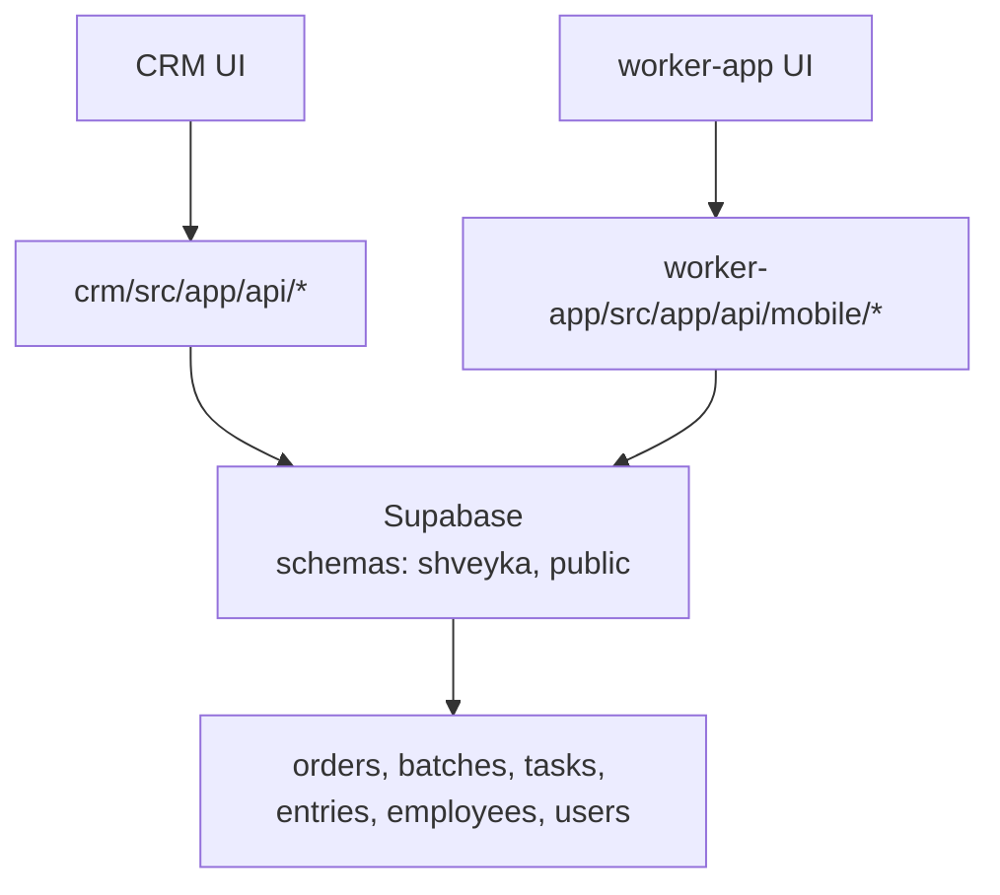
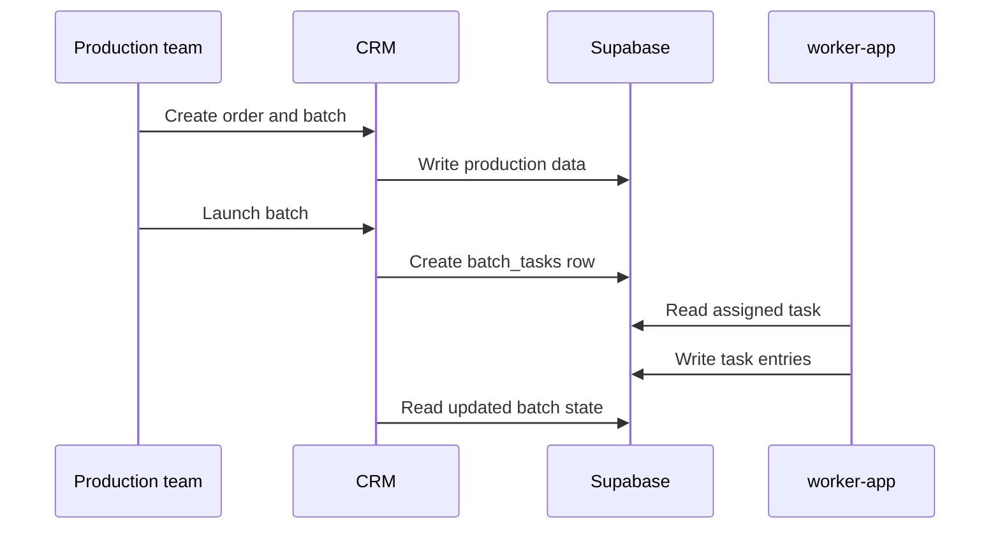

# MES Shveyka

Shveyka is a manufacturing execution system split into two Next.js apps:

- `crm` - production planning, master data, manufacturing workflow, and admin
  tooling.
- `worker-app` - shop-floor execution for workers and masters.

Supabase is the system of record for both apps.

## Repository layout



## What each app does

### CRM

- orders and production orders
- production batches and batch launch
- employees, positions, product models, route cards
- analytics and knowledge features
- AI assistant endpoint

### worker-app

- worker login
- task queue and task detail views
- entry capture for stages and operations
- cutting nastils and master approvals
- offline sync support

## Architecture at a glance



## Key schemas

- `shveyka` - primary application schema.
- `public` - legacy/shared tables that are still used by part of the worker
  flow.

## Running locally

The two apps are run independently.

### CRM

```bash
cd crm
npm install
npm run dev
```

Default port: `3004`

### worker-app

```bash
cd worker-app
npm install
npm run dev
```

Default port: `3005`

## Environment variables

Both apps depend on Supabase and auth secrets. At minimum, configure:

```bash
NEXT_PUBLIC_SUPABASE_URL=
NEXT_PUBLIC_SUPABASE_ANON_KEY=
SUPABASE_SERVICE_ROLE_KEY=
JWT_SECRET=
```

`crm` uses the service role only for server-side operations that must bypass
public RLS, such as login lookup and protected admin actions.

## Documentation

- [CRM OpenAPI](./crm/docs/api/production-workflow.yaml)
- [CRM API index](./crm/docs/api/README.md)
- [Worker mobile OpenAPI](./worker-app/docs/api/mobile.openapi.yaml)
- [Worker API index](./worker-app/docs/api/README.md)
- [Clean Architecture](./crm/docs/architecture/clean-architecture.md)
- [Manufacturing process](./crm/docs/production/manufacturing-process.md)
- [AI assistant contract](./crm/docs/api/ai-assistant-v2.yaml)

## Core flow

1. Create or update master data in CRM.
2. Create a production order.
3. Approve and launch the order.
4. Create a batch manually from the order.
5. Launch the batch to create a worker task.
6. Worker-app consumes the task and records entries.
7. CRM shows the resulting stage and batch state.



## Notes

- Keep Mermaid diagrams, Swagger files, and architecture docs in sync with the
  actual route handlers.
- `shveyka.users` is the worker access table.
- `shveyka.employees` is the personnel directory.
- `task_entries` is the canonical execution log; `cutting_nastils` remains a
  compatibility mirror.
