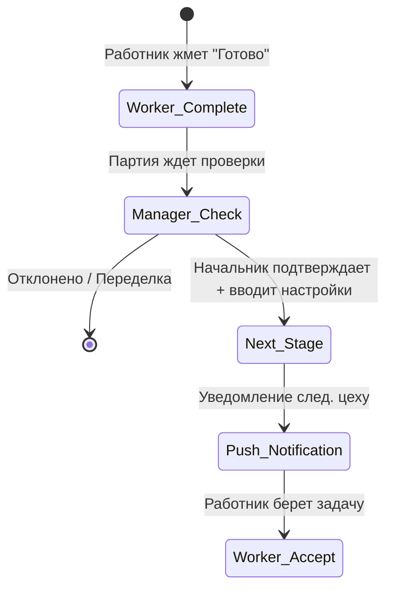

# ADR-001: Переход на Stage-Gate Workflow (Поэтапная передача)

**Status:** Accepted
**Date:** 2026-04-14
**Authors:** Dev Team

## 1. Context (Контекст)
Ранее подтверждение выработки работником автоматически двигало партию дальше или требовало ручного подтверждения во вкладке "Мастер". Это размывало ответственность: Мастер подтверждал ЗП, но не контролировал параметры следующего этапа (нитки, узоры).

## 2. Decision (Решение)
Внедрен процесс **Stage-Gate**:
1.  Работник завершает этап → Партия получает статус `ready_for_review` (или остается на этапе со статусом "Готово").
2.  **Начальник производства** заходит в карточку партии, проверяет данные.
3.  Начальник **вручную** нажимает "Підтвердити та передати".
4.  В модалке задаются параметры для **следующего** этапа (нитки, цвет).
5.  Система начисляет ЗП и создает задачу для следующей роли.

## 3. Consequences (Последствия)
### Positive
*   Контроль качества на каждом этапе.
*   Точная передача параметров (техническая карта) следующему цеху.
*   Начальник управляет загрузкой цеха (не пускает партию, если цех занят).

### Negative
*   Требуется действие начальника (не полностью автоматический поток).

## 4. Mermaid Diagram

