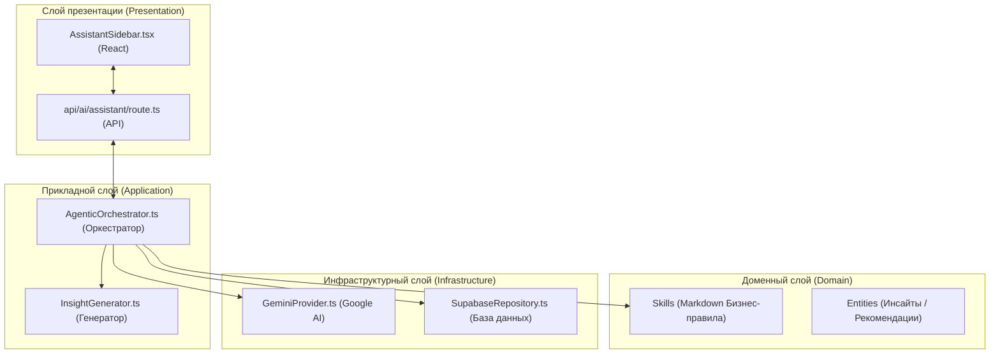

# Архитектура Агентского Ассистента (Clean Architecture)

### Описание слоев:
1.  **Presentation**: Обработка запросов пользователя и визуализация по правилу 3-30-300.
2.  **Application**: Главный дирижер (Orchestrator). Не знает о деталях реализации Gemini или Supabase, только координирует их.
3.  **Domain**: "Чистые" правила швейного производства и дизайна, хранящиеся в Markdown.
4.  **Infrastructure**: Технические детали — как именно мы ходим в Gemini или Supabase.
