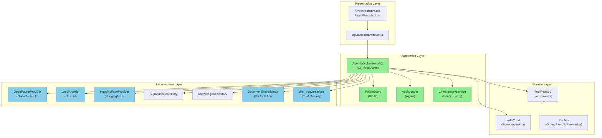
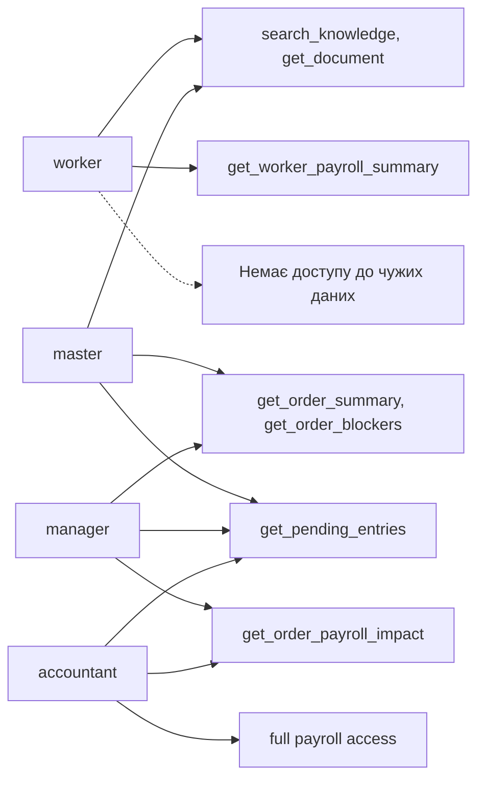
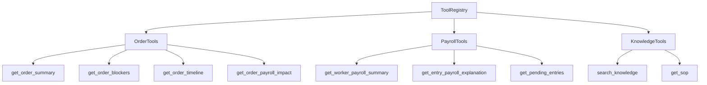
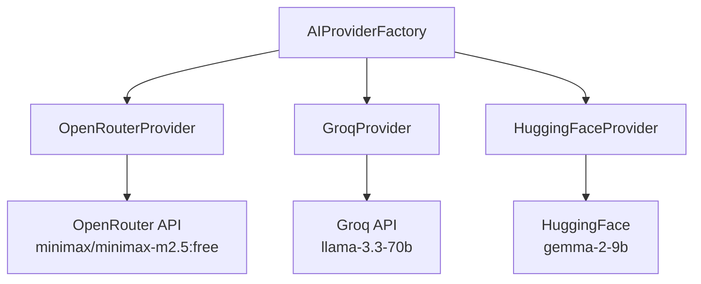
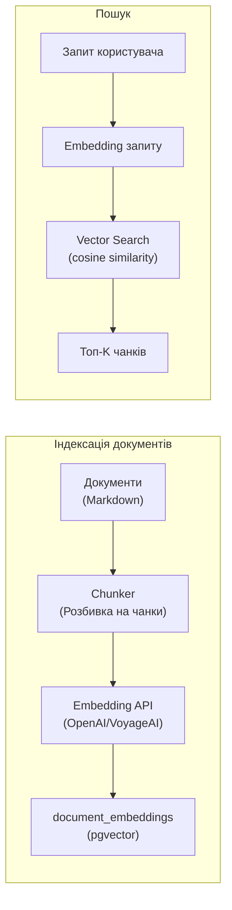
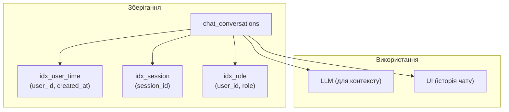
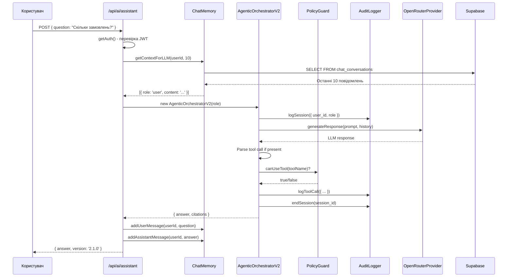

# Архитектура AI Ассистента (MES Shveyka)

## Обзор

AI Ассистент MES Shveyka — повнофункціональна agentic система з підтримкою:

- **Role-based Access Control (RBAC)** — PolicyGuard
- **Tool-based Execution** — інструменти для роботи з даними
- **Audit Logging** — логування всіх операцій
- **Chat Memory** — збереження історії розмов користувача
- **Vector RAG** — семантичний пошук по документах
- **Citations** — посилання на джерела даних
- **Українська мова** — системний промпт

---

## Clean Architecture



---

## Компоненти

### 1. Presentation Layer

| Компонент | Опис |
|-----------|------|
| `OrderAssistant.tsx` | UI для пояснення статусу замовлень |
| `PayrollAssistant.tsx` | UI для пояснення розрахунку зарплати |
| `AssistantSidebar.tsx` | Бічна панель з AI чатом |

### 2. API Layer (`/api/ai/assistant`)

#### Endpoints

| Метод | Endpoint | Опис |
|-------|----------|------|
| POST | `/api/ai/assistant` | Основний чат з ассистентом |
| GET | `/api/ai/assistant/history` | Отримати історію чату користувача |
| DELETE | `/api/ai/assistant/history` | Очистити історію чату |

#### POST Request

```yaml
/api/ai/assistant:
  post:
    summary: Чат з AI ассистентом
    description: |
      Повідомлення від користувача + отримання відповіді ассистента.
      Відповідь зберігається в chat_conversations.
    tags:
      - AI Assistant
    security:
      - bearerAuth: []
    requestBody:
      required: true
      content:
        application/json:
          schema:
            type: object
            required:
              - question
            properties:
              question:
                type: string
                description: Питання користувача українською мовою
                example: "Скільки замовлень у статусі cutting?"
              history:
                type: array
                description: Історія попередніх повідомлень
                items:
                  $ref: '#/components/schemas/ChatMessage'
              mode:
                type: string
                enum: [agentic, direct]
                default: agentic
              action:
                type: string
                enum: [explain-order, explain-payroll]
              orderId:
                type: integer
                description: ID замовлення для action=explain-order
              employeeId:
                type: integer
                description: ID працівника для action=explain-payroll
              periodId:
                type: integer
                description: ID періоду для action=explain-payroll
    responses:
      '200':
        description: Відповідь ассистента
        content:
          application/json:
            schema:
              $ref: '#/components/schemas/AIResponse'
```

### 3. Application Layer

#### AgenticOrchestratorV2

Головний оркестратор з повним функціоналом:

```typescript
class AgenticOrchestratorV2 {
  private policyGuard: PolicyGuard;      // RBAC
  private auditLogger: AuditLogger;      // Аудит
  private toolRegistry: ToolRegistry;    // Інструменти
  private knowledgeRepo: KnowledgeRepository;
  private ai: AIProvider;                // AI провайдер

  // Основні методи
  async handleQuery(
    message: string,
    context: { order_id?, worker_id?, period_id? },
    history: any[]
  ): Promise<{ answer: string, citations: Citation[] }>

  async explainOrder(orderId: number): Promise<string>
  async explainPayroll(employeeId?: number, periodId?: number): Promise<string>
  async retrieveSOP(sopName: string): Promise<string>
  async searchKnowledge(query: string, limit?: number): Promise<SearchResult[]>
  async getSmartInsights(): Promise<string>
}
```

#### PolicyGuard (RBAC)

Контроль доступу на основі ролей:



**Ролі та дозволи:**

| Інструмент | worker | master | manager | accountant |
|------------|--------|--------|---------|------------|
| `search_knowledge` | ✅ | ✅ | ✅ | ✅ |
| `get_document` | ✅ | ✅ | ✅ | ✅ |
| `get_order_summary` | ✅ | ✅ | ✅ | ✅ |
| `get_order_blockers` | ❌ | ✅ | ✅ | ❌ |
| `get_order_timeline` | ❌ | ✅ | ✅ | ❌ |
| `get_order_payroll_impact` | ❌ | ❌ | ✅ | ✅ |
| `get_worker_payroll_summary` | Власна | Власна | ✅ | ✅ |
| `get_pending_entries` | ❌ | ✅ | ✅ | ✅ |

**Sensitive поля (фільтруються за роллю):**

| Роль | Приховані поля |
|------|---------------|
| worker | other_employee_payroll, cost_prices, margins |
| master | cost_prices, margins |
| manager | (немає) |
| accountant | (немає) |

#### AuditLogger

Логування всіх операцій:

```typescript
interface AuditSession {
  session_id: string;
  user_id: string;
  role: string;
  context: Record<string, any>;
  started_at: string;
  ended_at?: string;
}

interface ToolCallLog {
  session_id: string;
  tool_name: string;
  tool_input: Record<string, any>;
  tool_output?: Record<string, any>;
  latency_ms: number;
  created_at: string;
}
```

#### ChatMemoryService

Сервіс пам'яті чату для збереження історії розмов:

```typescript
class ChatMemoryService {
  // Додати повідомлення
  async addMessage(userId, role, content, sessionId?, messageType?, metadata?): Promise<string>
  async addUserMessage(userId, content, sessionId?): Promise<string>
  async addAssistantMessage(userId, content, sessionId?): Promise<string>

  // Отримати історію
  async getHistory(userId, limit?, offset?): Promise<ChatMessage[]>
  async getContextForLLM(userId, messageCount?): Promise<any[]>

  // Управління
  async clearHistory(userId): Promise<number>
  async getConversationCount(userId): Promise<number>
}
```

### 4. Domain Layer

#### ToolRegistry

Реєстр доступних інструментів:



### 5. Infrastructure Layer

#### AI Providers



#### Vector RAG Architecture



#### Chat Memory Storage



---

## Flow: Обробка запиту користувача



---

## Версії

| Версія | Опис | Статус |
|--------|------|--------|
| 1.0.0-classic | Простий wrapper | Legacy |
| 2.0.0-agentic | AgenticOrchestrator з tools | Legacy |
| **2.1.0** | V2 + PolicyGuard + Audit + ChatMemory | **Production** |

---

## Мовна підтримка

### Системний промпт (українська мова)

Всі відповіді ассистента генеруються **виключно українською мовою**:

```typescript
const systemInstructions = `[СИСТЕМНА ІНСТРУКЦІЯ]:
Ти — професійний AI-асистент швейного виробництва "Швейка".
Твоя спеціалізація: розкрій, пошив, склад матеріалів, облік браку та аналітика партій.

ВИМОГИ:
1. СПІЛКУВАННЯ ВИКЛЮЧНО УКРАЇНСЬКОЮ МОВОЮ
2. Відповідай коротко і по суті
3. Використовуй простий язык, зрозумілий працівникам виробництва
4. Форматуй відповіді структуровано: факт → висновок → дія
5. Посилання на джерела обов'язкові
`;
```

---

## Змінні оточення

```bash
# AI Configuration
SCOUT_AGENT_PROVIDER=openrouter-sdk  # google, openrouter-sdk, groq, huggingface-gemma

# OpenRouter (основний провайдер)
OPENROUTER_API_KEY=sk-or-v1-...
OPENROUTER_MODEL=minimax/minimax-m2.5:free

# Groq
GROQ_API_KEY=gsk_...

# HuggingFace
HUGGINGFACE_API_KEY=hf_...
GEMMA_MODEL=google/gemma-2-9b-it
```

---

## Безопасність

### Аутентификация
- Всі endpoints вимагають валідний JWT токен
- Токен перевіряється через `getAuth()` з `@/lib/auth-server`

### Авторизация (RBAC)
- Кожен запит створює orchestrator з роллю користувача
- PolicyGuard перевіряє доступ до інструментів
- Sensitive дані фільтруються на виході

### Аудит
- Всі сесії логуються в `assistant_sessions`
- Всі виклики інструментів логуються в `assistant_tool_calls`
- Логи включають: user_id, role, tool_name, input, output, latency

### Chat Memory Security
- RLS політика: користувач бачить тільки свої повідомлення
- `user_id = current_setting('request.jwt.claim.user_id')`

---

## Бази даних

### Таблиці

| Таблиця | Опис |
|---------|------|
| `shveyka.chat_conversations` | Історія повідомлень чату |
| `shveyka.document_embeddings` | Векторні представлення документів |
| `shveyka.knowledge_chunks` | Чанки документів для пошуку |
| `shveyka.assistant_sessions` | Сесії ассистента (аудит) |
| `shveyka.assistant_tool_calls` | Виклики інструментів (аудит) |

### Функції

| Функція | Опис |
|---------|------|
| `get_chat_history(user_id, limit, offset)` | Отримати історію чату |
| `add_chat_message(...)` | Додати повідомлення |
| `clear_chat_history(user_id)` | Очистити історію |
| `get_chat_context(user_id, count)` | Контекст для LLM |
| `semantic_search(query, limit)` | Семантичний пошук |

---

## Обмеження

1. **Vector RAG** — таблиця створена, але потребує підключення embedding provider (Supabase Vectorize / OpenAI)
2. **Chat Memory** — повністю інтегрована, але потребує міграції БД
3. **Admin client** — інструменти використовують `supabaseAdmin`, обходять RLS
4. **Rate limits** — безкоштовні моделі OpenRouter мають обмеження
5. **No streaming** — відповідь повертається цілком після генерації
6. **Knowledge base** — використовує FTS, не векторний пошук (fallback)

---

## Наступні кроки

1. Застосувати міграцію `20260417_chat_memory_and_vector_rag.sql`
2. Підключити Supabase Vectorize для семантичного пошуку
3. Інтегрувати ChatMemory в UI компоненти
4. Додати rate limiting для AI endpoints