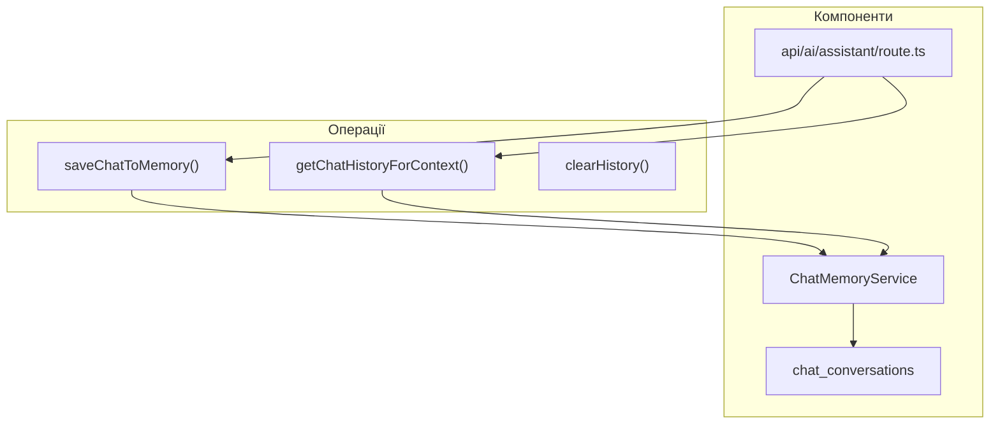

# Chat Memory Service

## Опис

ChatMemoryService забезпечує персистентне зберігання історії розмов користувача з AI ассистентом. Це дозволяє:

- Зберігати контекст між сесіями
- Передавати історію в LLM для кращого розуміння
- Відображати історію чату в UI
- Аналізувати поведінку користувачів

---

## Архітектура



---

## Структура даних

### Таблиця `chat_conversations`

| Поле | Тип | Опис |
|------|-----|------|
| `id` | UUID | PRIMARY KEY |
| `user_id` | INTEGER | ID користувача |
| `role` | TEXT | 'user' \| 'assistant' \| 'system' |
| `content` | TEXT | Текст повідомлення |
| `session_id` | UUID | ID сесії (nullable) |
| `message_type` | TEXT | 'text' \| 'action' \| 'error' |
| `metadata` | JSONB | Додаткові дані |
| `created_at` | TIMESTAMPTZ | Час створення |

### Індекси

```sql
-- Швидкий пошук по користувачу і часу
CREATE INDEX idx_chat_conversations_user_time
ON shveyka.chat_conversations (user_id, created_at DESC);

-- Пошук по сесії
CREATE INDEX idx_chat_conversations_session
ON shveyka.chat_conversations (session_id) WHERE session_id IS NOT NULL;

-- Пошук по ролі
CREATE INDEX idx_chat_conversations_role
ON shveyka.chat_conversations (user_id, role, created_at DESC);
```

---

## API ChatMemoryService

```typescript
// Отримати екземпляр (singleton)
const chatMemory = getChatMemory();

// === Додавання повідомлень ===

// Додати повідомлення користувача
const userMsgId = await chatMemory.addUserMessage(
  userId: number,
  content: string,
  sessionId?: string
): Promise<string>

// Додати відповідь ассистента
const assistantMsgId = await chatMemory.addAssistantMessage(
  userId: number,
  content: string,
  sessionId?: string
): Promise<string>

// Додати будь-яке повідомлення
const msgId = await chatMemory.addMessage(
  userId: number,
  role: 'user' | 'assistant' | 'system',
  content: string,
  sessionId?: string,
  messageType?: string,
  metadata?: Record<string, any>
): Promise<string>

// === Отримання історії ===

// Отримати історію для UI
const history = await chatMemory.getHistory(
  userId: number,
  limit?: number = 50,
  offset?: number = 0
): Promise<ChatMessage[]>

// Отримати контекст для LLM (формат { role, content })
const context = await chatMemory.getContextForLLM(
  userId: number,
  messageCount?: number = 10
): Promise<Array<{ role: 'user' | 'assistant', content: string }>>

// === Управління ===

// Очистити всю історію користувача
const deletedCount = await chatMemory.clearHistory(
  userId: number
): Promise<number>

// Отримати кількість повідомлень
const count = await chatMemory.getConversationCount(
  userId: number
): Promise<number>
```

---

## Використання в API Route

```typescript
import { getChatMemory } from '@/lib/ai/agentic/infrastructure/ChatMemoryService';

export async function POST(request: Request) {
  const auth = await getAuth();
  const { userId } = auth;

  const body = await request.json();
  const { question, history } = body;

  const orchestrator = new AgenticOrchestratorV2(role);
  const result = await orchestrator.handleQuery(question, {}, history || []);

  // Зберегти в історію чату
  const chatMemory = getChatMemory();
  await chatMemory.addUserMessage(userId, question);
  await chatMemory.addAssistantMessage(userId, result.answer);

  return ApiResponse.success({
    answer: result.answer,
    citations: result.citations,
    version: '2.1.0'
  });
}
```

---

## Отримання контексту для LLM

```typescript
// Отримати останні 10 повідомлень для контексту
const context = await chatMemory.getContextForLLM(userId, 10);

// Результат:
// [
//   { role: 'user', content: 'Скільки замовлень?' },
//   { role: 'assistant', content: 'У вас є 5 замовлень...' },
//   { role: 'user', content: 'Які з них у статусі cutting?' },
//   { role: 'assistant', content: '2 замовлення...' }
// ]

// Передаємо в LLM
const response = await openRouterProvider.generateResponse(
  prompt,
  context  // history для підтримки контексту
);
```

---

## Безпека (RLS)

```sql
-- Користувач бачить тільки свої повідомлення
CREATE POLICY "Users can view own chat history"
ON shveyka.chat_conversations
FOR SELECT
USING (user_id = current_setting('request.jwt.claim.user_id', true)::INTEGER);

-- Користувач додає тільки свої повідомлення
CREATE POLICY "Users can insert own chat messages"
ON shveyka.chat_conversations
FOR INSERT
WITH CHECK (user_id = current_setting('request.jwt.claim.user_id', true)::INTEGER);

-- Користувач видаляє тільки свою історію
CREATE POLICY "Users can delete own chat history"
ON shveyka.chat_conversations
FOR DELETE
USING (user_id = current_setting('request.jwt.claim.user_id', true)::INTEGER);

ALTER TABLE shveyka.chat_conversations ENABLE ROW LEVEL SECURITY;
```

---

## Функції PostgreSQL

### get_chat_history

```sql
-- Отримати історію чату користувача
SELECT * FROM shveyka.get_chat_history(
  p_user_id := 123,
  p_limit := 50,
  p_offset := 0
);
```

### get_chat_context

```sql
-- Отримати контекст для LLM (повертає текст)
SELECT shveyka.get_chat_context(123, 10);
-- Результат:
-- User: Скільки замовлень?
-- Assistant: У вас є 5 замовлень...
-- User: Які з них у статусі cutting?
-- Assistant: 2 замовлення...
```

### clear_chat_history

```sql
-- Очистити історію користувача
SELECT shveyka.clear_chat_history(123);
-- Повертає кількість видалених записів
```

---

## Міграція

```bash
# Застосувати міграцію
supabase db push

# Або через psql
psql -h <host> -U postgres -d postgres -f \
  supabase/migrations/20260417_chat_memory_and_vector_rag.sql
```

---

## Обмеження

1. **Контекст LLM** — обмежений `messageCount` (за замовчуванням 10)
2. **Storage** — історія зберігається безлічч
3. **No compression** — повні повідомлення, без стиснення
4. **No pagination in UI** — потрібно додати в компонентах