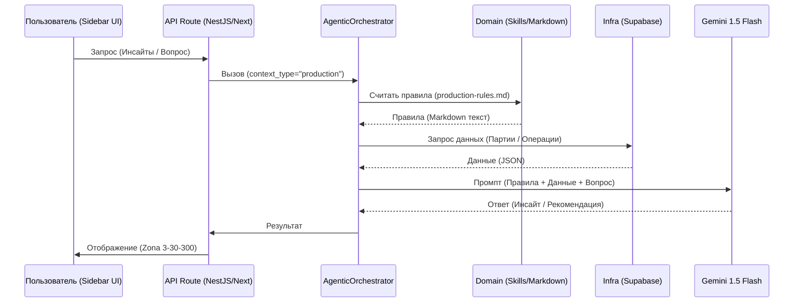

# Поток Навыков (Skill Flow) 

Эта диаграмма описывает, как ИИ-агент подтягивает "знания" (Skills) из файлов перед ответом пользователю.

### Ключевые моменты:
1.  **Skills (Domain)**: Это наш "Первоисточник истины". Мы можем менять правила без переписывания кода.
2.  **Infrastructure**: Отвечает за доставку "свежих" данных из БД.
3.  **Gemini**: Выполняет финальную обработку, следуя правилам из Markdown.
