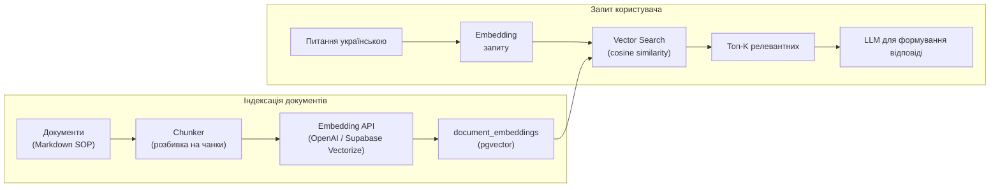
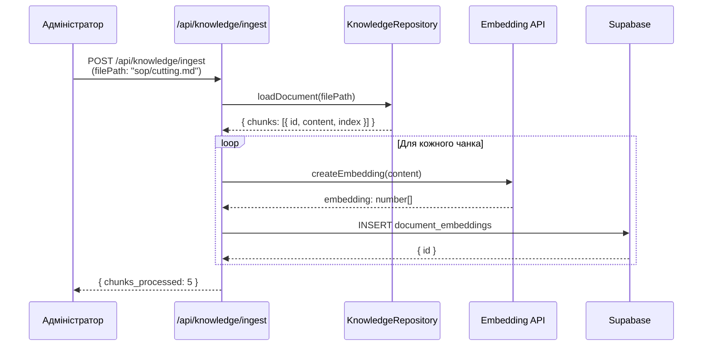
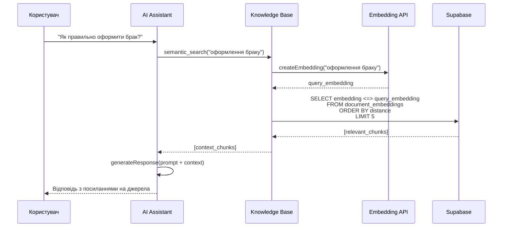

# Vector RAG (Retrieval-Augmented Generation)

## Опис

Vector RAG забезпечує семантичний пошук по документах бази знань за допомогою векторних ембеддінгів. Дозволяє знаходити релевантні документи не за ключовими словами, а за **смислом**.

---

## Архітектура



---

## Порівняння пошуку

| Тип | Як працює | Приклад |
|-----|-----------|---------|
| **FTS (зараз)** | Keyword matching | "зарплата" → "зарплата" |
| **Vector (потрібно)** | Semantic similarity | "гроші працівникам" → "зарплата, нарахування, оплата" |

---

## Таблиці та функції

### Таблиця `document_embeddings`

```sql
CREATE TABLE shveyka.document_embeddings (
    id UUID PRIMARY KEY DEFAULT gen_random_uuid(),
    chunk_id UUID REFERENCES shveyka.knowledge_chunks(id) ON DELETE CASCADE,
    embedding vector(1536),  -- 1536 вимірів для text-embedding-3-small
    content_preview TEXT,    -- Перші 500 символів
    source_path TEXT NOT NULL,
    created_at TIMESTAMPTZ DEFAULT NOW()
);

-- HNSW індекс для швидкого векторного пошуку
CREATE INDEX idx_document_embeddings_vector
ON shveyka.document_embeddings
USING hnsw (embedding vector_cosine_ops)
WITH (m = 16, ef_construction = 64);
```

### Функція semantic_search

```sql
SELECT * FROM shveyka.semantic_search(
  query_text := 'як оформити брак',
  limit_count := 5
);
-- Повертає найбільш релевантні чанки з knowledge_chunks
```

### Функція refresh_document_embeddings

```sql
-- Оновити ембеддінги для документа
SELECT shveyka.refresh_document_embeddings('sop/quality-control.md');
```

---

## Провайдери ембеддінгів

### Option 1: Supabase Vectorize (рекомендовано)

```sql
-- Налаштування Vectorize в Supabase
-- Використовує вбудований API для генерації ембеддінгів
```

### Option 2: OpenAI Embeddings

```typescript
// Edge Function для генерації ембеддінгів
const { data } = await openai.embeddings.create({
  model: 'text-embedding-3-small',
  input: documentText,
});

// Збереження в БД
await supabase.from('document_embeddings').insert({
  chunk_id: chunkId,
  embedding: data[0].embedding,
  source_path: sourcePath,
});
```

### Option 3: Voyage AI

```typescript
import { VoyageAI } from 'voyageai';

const voyage = new VoyageAI({ apiKey: process.env.VOYAGE_API_KEY });
const { data } = await voyage.embed({
  inputs: documents,
  model: 'voyage-3',
});
```

---

## Workflow: Індексація документа



---

## Workflow: Семантичний пошук



---

## Порівняння з поточним FTS

| Характеристика | FTS (поточний) | Vector RAG (план) |
|----------------|----------------|-------------------|
| Тип пошуку | Keyword matching | Semantic similarity |
| Розуміння мови | Словник | Контекст, сенс |
| Російська/українська | ✅ Підтримується | ✅ Підтримується |
| Потребує | `to_tsvector` | `pgvector`, embedding API |
| Складність | Низька | Середня |
| Точність | 60-70% | 85-95% |

---

## Інтеграція з AgenticOrchestratorV2

```typescript
// В AgenticOrchestratorV2
async searchKnowledge(query: string, limit: number = 5) {
  // Варіант 1: FTS (поточний, fallback)
  return this.knowledgeRepo.searchKnowledge(query, limit);

  // Варіант 2: Vector search (коли підключено)
  // return this.vectorRepo.semanticSearch(query, limit);
}
```

---

## Налаштування

### 1. Встановити розширення vector

```sql
CREATE EXTENSION IF NOT EXISTS vector CASCADE;
```

### 2. Підключити Supabase Vectorize

```bash
# В Supabase Dashboard:
# Extensions > Vector > Enable
```

### 3. Налаштувати Edge Function для ембеддінгів

```typescript
// supabase/functions/generate-embeddings/index.ts
Deno.serve(async (req) => {
  const { content, chunk_id } = await req.json();

  // OpenAI embeddings
  const response = await openai.embeddings.create({
    model: 'text-embedding-3-small',
    input: content,
  });

  await supabase.rpc('store_embedding', {
    p_chunk_id: chunk_id,
    p_embedding: response.data[0].embedding,
  });

  return new Response(JSON.stringify({ success: true }));
});
```

---

## Обмеження

1. **Embedding cost** — OpenAI стягує плату за ембеддінги
2. **Dimension mismatch** — різні моделі мають різну розмірність (1536, 3072)
3. **Index rebuild** — при зміні chunking strategy потрібно переіндексувати
4. **No incremental update** — нові документи потребують окремого індексування

---

## Альтернативи

| Провайдер | Модель | Розмірність | Ціна |
|-----------|--------|-------------|------|
| OpenAI | text-embedding-3-small | 1536 | $0.02/1M tokens |
| OpenAI | text-embedding-3-large | 3072 | $0.13/1M tokens |
| Voyage AI | voyage-3 | 1024 | $0.10/1M tokens |
| Supabase Vectorize | — | 1536 | Включено в план |