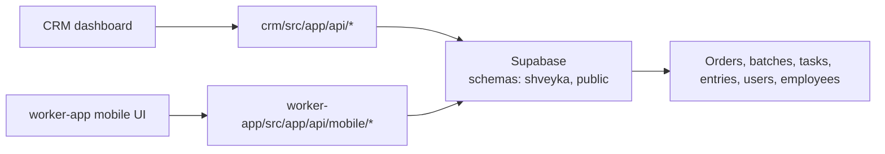

# API Documentation Index

This folder tracks the canonical API docs for the CRM side of Shveyka.

## What lives here

- `production-workflow.yaml` - Swagger/OpenAPI for the manufacturing workflow
  implemented by the CRM app.
- `ai-assistant-v2.yaml` - the AI assistant contract used by the CRM app.

## Related API docs

- `../../../worker-app/docs/api/mobile.openapi.yaml` - worker mobile API.

## Current auth and data boundaries

- CRM login uses `POST /api/auth/login`.
- The login route performs a server-side lookup through the Supabase service
  role so `shveyka.users` can be checked even when RLS blocks public access.
- Worker login uses `employee_number + PIN + password` and issues a signed JWT
  cookie.
- `shveyka` is the primary application schema.
- `public` still hosts a few legacy/shared tables such as `operation_entries`.

## Usage notes

- Keep the OpenAPI files in sync with the actual route handlers.
- Prefer adding a short note here when a route group changes shape or moves
  between schemas.
