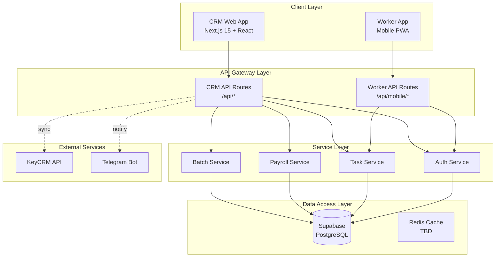
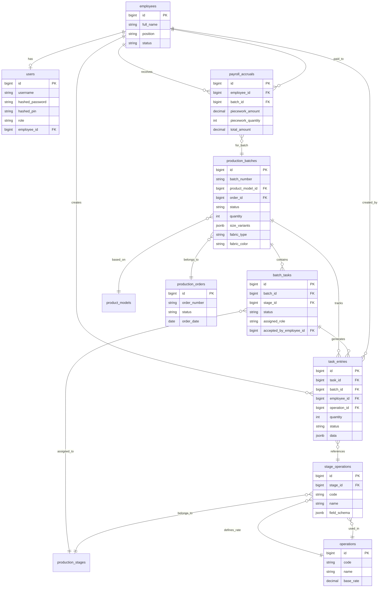
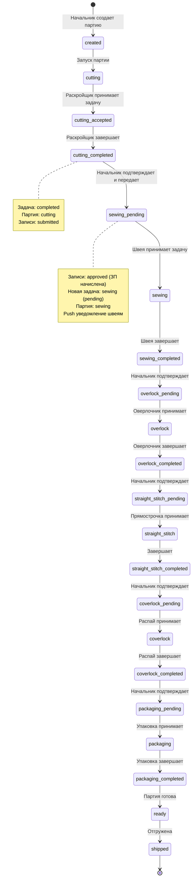
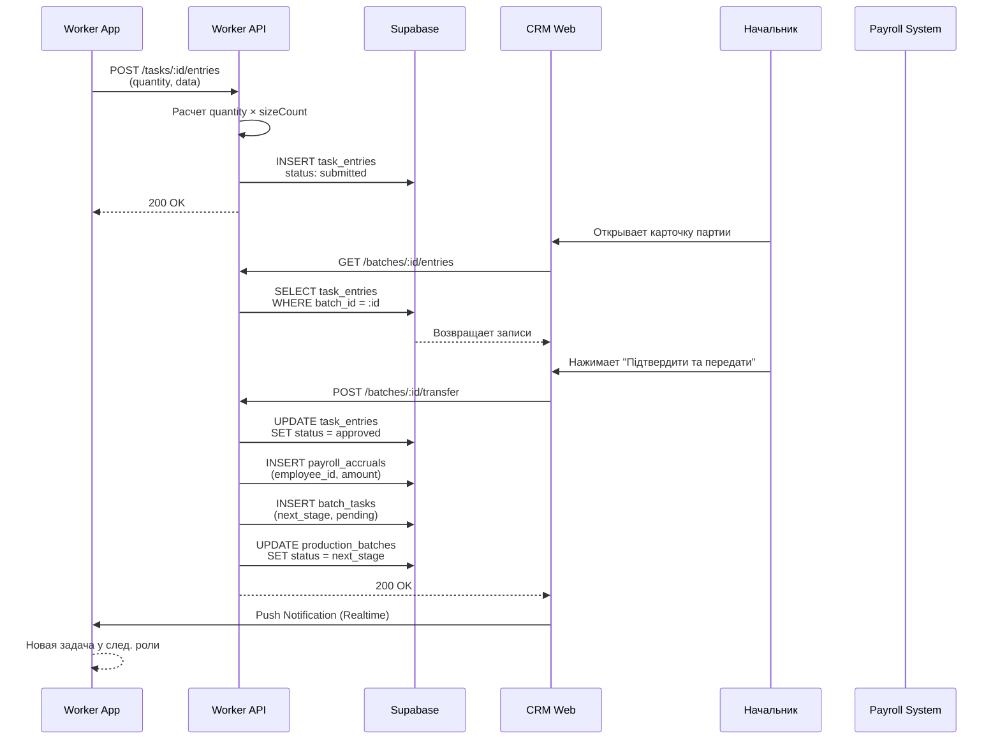
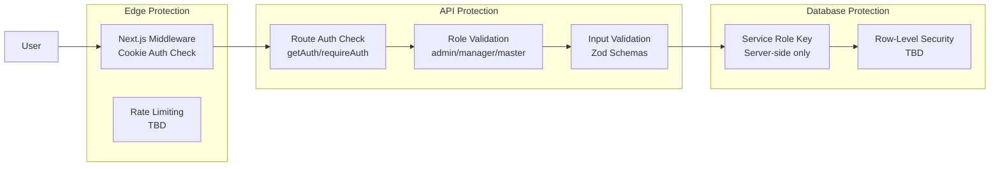

# 🏗 Shveyka MES — System Architecture

> Полная архитектурная документация системы управления производством (MES) для швейного цеха.

## 1. High-Level Architecture



## 2. Database Schema (shveyka)



## 3. Production Flow (Stage-Gate)



## 4. Data Flow: Worker → CRM → Payroll



## 5. Clean Architecture Layers

```
┌─────────────────────────────────────────────────┐
│           Presentation Layer (UI)                │
│  src/app/(dashboard)/**  │  src/components/**    │
└──────────────────────┬──────────────────────────┘
                       │
┌──────────────────────▼──────────────────────────┐
│              Application Layer                   │
│  src/app/api/** (Next.js Route Handlers)        │
│  - Request validation (Zod)                     │
│  - Authentication/Authorization                 │
│  - Response formatting                          │
└──────────────────────┬──────────────────────────┘
                       │
┌──────────────────────▼──────────────────────────┐
│               Domain Layer (Services)            │
│  src/services/** (TBD)                          │
│  - BatchService, PayrollService, TaskService    │
│  - Pure business logic, no DB coupling           │
└──────────────────────┬──────────────────────────┘
                       │
┌──────────────────────▼──────────────────────────┐
│            Infrastructure Layer                  │
│  src/lib/supabase/**  │  src/lib/auth*.ts        │
│  - Database clients, Auth providers             │
│  - External API integrations (KeyCRM)           │
└─────────────────────────────────────────────────┘
```

## 6. Security Architecture



## 7. File Structure

```
shveyka_v2-main/
├── crm/                              # CRM Web Application
│   ├── src/
│   │   ├── app/
│   │   │   ├── (dashboard)/          # Protected dashboard pages
│   │   │   │   ├── batches/          # Управление партиями
│   │   │   │   ├── orders/           # Заказы
│   │   │   │   ├── payroll/          # Зарплата
│   │   │   │   ├── employees/        # Сотрудники
│   │   │   │   └── ...
│   │   │   ├── api/                  # API Routes (Backend)
│   │   │   │   ├── batches/          # CRUD партий
│   │   │   │   ├── entries/          # Записи выработки
│   │   │   │   ├── payroll/          # Расчет ЗП
│   │   │   │   └── ...
│   │   │   └── layout.tsx
│   │   ├── components/               # Reusable UI components
│   │   ├── lib/                      # Utilities (supabase, auth, etc)
│   │   ├── types/                    # TypeScript definitions
│   │   └── services/                 # Business logic (TBD)
│   ├── supabase/
│   │   └── migrations/               # Database schema changes
│   └── docs/                         # Documentation
│
├── worker-app/                       # Worker Mobile PWA
│   ├── src/
│   │   ├── app/(worker)/
│   │   │   ├── tasks/                # Список задач
│   │   │   ├── tasks/[id]/           # Детали задачи
│   │   │   └── batches/              # Конвейер партий
│   │   ├── app/api/mobile/           # Worker-specific API
│   │   ├── lib/                      # Utilities
│   │   └── components/               # Worker UI components
```
