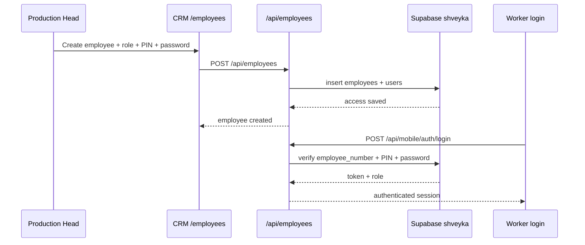
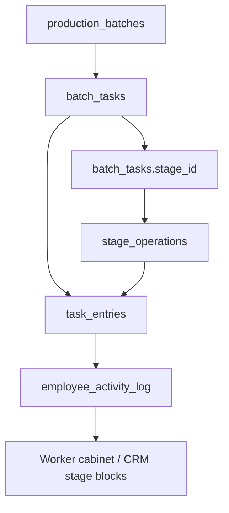

# Clean Architecture для производственного контура CRM

Этот документ фиксирует текущее разделение ответственности в `crm`.

## Контекст

Производственный контур сейчас строится так:

- `Замовлення` создается и подтверждается как производственный заказ.
- BOM живет в справочнике моделей.
- MRP считает потребность под конкретный заказ.
- Партия создается вручную внутри карточки заказа.
- Маршрутные карты нужны только для операций и технологического маршрута.

## Mermaid

```mermaid
graph TD
    subgraph Presentation["Presentation"]
        A["src/app/(dashboard)/orders/page.tsx"]
        B["src/app/(dashboard)/production-orders/page.tsx"]
        C["src/app/(dashboard)/production-orders/[id]/page.tsx"]
        D["src/app/(dashboard)/product-models/page.tsx"]
        E["src/app/(dashboard)/batches/page.tsx"]
        F["src/components/Sidebar.tsx"]
    end

    subgraph Application["Application"]
        G["src/app/api/production-orders/route.ts"]
        H["src/app/api/production-orders/[id]/route.ts"]
        I["src/app/api/production-orders/[id]/lines/route.ts"]
        J["src/app/api/production-orders/[id]/events/route.ts"]
        K["src/app/api/production-orders/[id]/requirements/route.ts"]
        L["src/app/api/production-orders/[id]/[action]/route.ts"]
        M["src/app/api/production-orders/[id]/batches/route.ts"]
        N["src/app/api/batches/route.ts"]
        O["src/app/api/batches/[id]/route.ts"]
        P["src/app/api/batches/[id]/pipeline/route.ts"]
        Q["src/app/api/batches/[id]/status/route.ts"]
        R["src/app/api/product-models/*"]
    end

    subgraph Domain["Domain"]
        S["shveyka.production_orders"]
        T["shveyka.production_order_lines"]
        U["shveyka.production_order_events"]
        V["shveyka.production_order_materials"]
        W["shveyka.production_batches"]
        X["shveyka.product_models"]
        Y["shveyka.material_norms"]
        Z["shveyka.route_cards"]
    end

    subgraph Infrastructure["Infrastructure"]
        AA["Supabase schema shveyka"]
        AB["Supabase RPC / SQL"]
        AC["Auth / role checks"]
        AD["Warehouse balances"]
    end

    F --> A
    F --> B
    F --> C
    F --> D
    F --> E
    A --> G
    B --> G
    C --> H
    C --> I
    C --> J
    C --> K
    C --> L
    C --> M
    E --> N
    E --> O
    E --> P
    E --> Q
    D --> R

    G --> AA
    H --> AA
    I --> AA
    J --> AA
    K --> AB
    L --> AB
    M --> AA
    N --> AA
    O --> AA
    P --> AA
    Q --> AA
    R --> AA

    AA --> S
    AA --> T
    AA --> U
    AA --> V
    AA --> W
    AA --> X
    AA --> Y
    AA --> Z
    AB --> Y
    AB --> V
    AC --> G
    AC --> H
    AC --> I
    AC --> J
    AC --> K
    AC --> L
    AC --> M
    AC --> N
    AC --> O
    AD --> V
```

## Правила разбиения

1. Presentation-слой показывает данные и вызывает API.
2. Application-слой реализует сценарии:
   - создание заказа
   - подтверждение
   - запуск
   - проверка потребности
   - ручное создание и редактирование партии
3. Domain-слой хранит бизнес-сущности и таблицы.
4. Infrastructure-слой отвечает за Supabase, RPC, права доступа и остатки склада.

## Domain-сущности

- `production_orders`
- `production_order_lines`
- `production_order_events`
- `production_order_materials`
- `production_batches`
- `product_models`
- `material_norms`
- `route_cards`

## Как разделены ответственности

### BOM / справочник моделей

- Модель определяет состав изделия.
- `material_norms` хранит нормы расхода материалов на 1 единицу.
- MRP считает потребность от модели, а не от маршрутной карты.

### MRP / расчет потребности

- `calculate_material_requirements()` разворачивает BOM под конкретный заказ.
- Результат сохраняется в `production_order_materials`.
- Экран заказа читает потребность из MRP-слоя.

### Route Cards

- Route cards не содержат материалов.
- Route cards не участвуют в расчете потребности.
- Route cards оставлены как задел под операции и технологический маршрут.
- `employees` хранит справочник людей и должностей.
- `users` хранит worker-app доступы: `username`, `hashed_pin`, `hashed_password`, `role`, `is_active`.

### Production Orders

- Заказ создается как `draft`.
- После подтверждения становится `approved`.
- После запуска становится `launched`.
- Запуск не создает партии автоматически.
- Партии создаются вручную в карточке заказа.

### Production Batches

- Партия создается под конкретную модель заказа.
- Партия содержит параметры ткани, цветов, рулонов и размеров.
- Партия редактируется и удаляется только в статусе `created`.

## Связанные API

- `GET /api/production-orders`
- `POST /api/production-orders`
- `PATCH /api/production-orders/{id}`
- `POST /api/production-orders/{id}/approve`
- `POST /api/production-orders/{id}/launch`
- `GET /api/production-orders/{id}/requirements`
- `POST /api/production-orders/{id}/batches`
- `GET /api/batches`
- `POST /api/batches`
- `GET /api/batches/{id}`
- `PUT /api/batches/{id}`
- `DELETE /api/batches/{id}`

## Cutting Task Flow

- CRM keeps `production_batches` in the `shveyka` schema.
- Shared execution data lives in `shveyka.batch_tasks` and `shveyka.cutting_nastils`.
- `POST /api/batches/{id}/launch` creates a `shveyka.batch_tasks` row and moves the batch to `cutting`.
- Worker app reads only `cutting` tasks for the `cutting` role.
- Worker app writes actual cutting facts directly into `cutting_nastils` and the task state.
- Batch facts remain the single visible source of truth for the production head; no separate cutting journal is introduced.

## Employee Access Flow

- CRM manages `employees` as the personnel directory.
- `users` stores authentication credentials for worker app access.
- Worker login requires `employee_number + PIN + password`.
- The role in `users.role` decides which stage tasks are visible in worker app.
- Deactivating an employee disables the linked worker access too.
- The public employee list excludes rows with `status = dismissed`; dismissed employees remain in the database for audit and history.

## Positions Directory

- `shveyka.positions` is the canonical positions directory used by employee forms.
- Employee create and edit screens load positions via `GET /api/positions` and use a select field instead of free text.
- Position CRUD lives in CRM at `/employees/positions`, so HR can maintain the list without editing employee records directly.
- The positions API falls back to a seeded list if the table is not yet present, so the UI stays usable during migrations.

## Stage Model

- `production_stages` is the canonical directory for manufacturing stages.
- `stage_operations` defines the operations inside a stage and the dynamic `field_schema` for the worker form.
- `task_entries` stores every recorded worker action as a unified entry stream.
- `employee_activity_log` stores a denormalized feed for the employee cabinet and audit views.
- The new model keeps the worker UI dynamic: a stage selects operations, and each operation defines the fields to render.
- `batch_tasks.stage_id` is the source of truth for the task stage.
- `assigned_role` remains only as a compatibility field during the transition window.
- Worker API reads the directory from `GET /api/mobile/stages` and persists submissions through `POST /api/mobile/tasks/{id}/entries`.
- The worker task detail page consumes `stage.operations` plus `field_schema`, so new operations can be added by seed data and migrations rather than UI code.
- Cutting remains compatible through `cutting_nastils`, but the unified path is `task_entries`.
- CRM batch card opens as a centered modal overlay and uses `GET /api/batches/{id}/stages` to render the stage tree inside the base card.
- Clicking a stage row opens a dedicated stage modal on top of the batch modal, replacing the stage list view.
- For `cutting`, the stage modal can open a dedicated nastil modal derived from `operation_code = nastil`, so production heads can inspect each roll in a separate overlay without expanding inline.
- The nastil modal also renders the batch size grid from the order/model sizes, and each cell shows the quantity per size for that roll.
- `POST /api/batches/{id}/stages` moves the batch to the next step after the current stage is completed.

- `production_batches.status` uses `shveyka.batch_status`; stage-transfer values are stored in the same schema, not in `public`.
