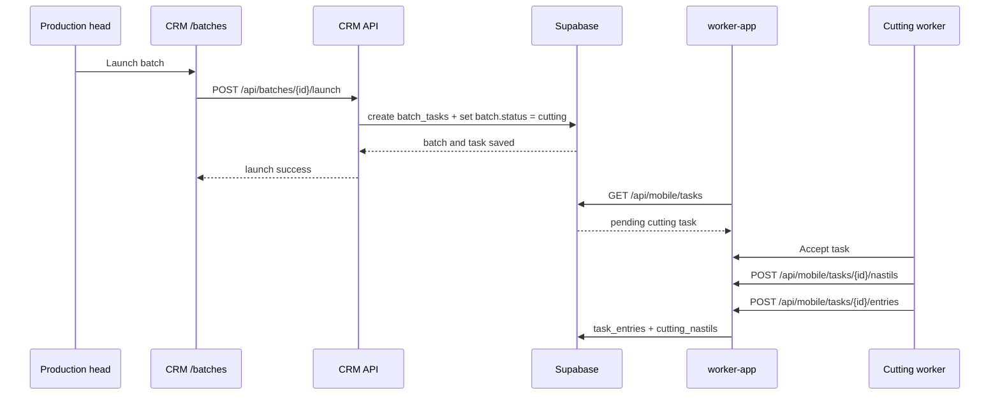

# Clean Architecture for Shveyka

This document captures the current boundaries of the monorepo and how the CRM
and worker apps share state through Supabase.

## Current shape

- CRM owns planning, dispatch, and master-data management.
- worker-app owns shop-floor execution.
- Supabase is the system of record.
- `shveyka` is the primary schema.
- `public` still contains a few legacy/shared tables, most notably
  `operation_entries`.

```mermaid
graph TD
  subgraph Presentation["Presentation"]
    CRMUI["CRM dashboard"]
    WorkerUI["worker-app mobile UI"]
  end

  subgraph Application["Application"]
    CRMAPI["crm/src/app/api/*"]
    WorkerAPI["worker-app/src/app/api/mobile/*"]
  end

  subgraph Domain["Domain / Data"]
    Orders["shveyka.production_orders"]
    OrderLines["shveyka.production_order_lines"]
    OrderEvents["shveyka.production_order_events"]
    Requirements["shveyka.production_order_materials"]
    Batches["shveyka.production_batches"]
    Tasks["shveyka.batch_tasks"]
    Stages["shveyka.production_stages"]
    StageOps["shveyka.stage_operations"]
    Entries["shveyka.task_entries"]
    Nastils["shveyka.cutting_nastils"]
    Users["shveyka.users"]
    Employees["shveyka.employees"]
    Legacy["public.operation_entries"]
  end

  subgraph Infrastructure["Infrastructure"]
    Supabase["Supabase service role / RLS"]
    JWT["JWT cookies"]
    Bcrypt["bcryptjs password verification"]
  end

  CRMUI --> CRMAPI
  WorkerUI --> WorkerAPI
  CRMAPI --> Supabase
  WorkerAPI --> Supabase
  Supabase --> Orders
  Supabase --> OrderLines
  Supabase --> OrderEvents
  Supabase --> Requirements
  Supabase --> Batches
  Supabase --> Tasks
  Supabase --> Stages
  Supabase --> StageOps
  Supabase --> Entries
  Supabase --> Nastils
  Supabase --> Users
  Supabase --> Employees
  Supabase --> Legacy
  JWT --> WorkerAPI
  Bcrypt --> WorkerAPI
  Bcrypt --> CRMAPI
```

## Layer rules

1. Presentation reads and renders data. It should not know about Supabase keys
   or schema rules.
2. Application routes validate input, perform authorization, and orchestrate
   writes.
3. Domain tables store business state; route handlers should not invent new
   state machines in the UI.
4. Infrastructure owns Supabase access, JWT signing, password hashing, and
   audit logging.

## Auth model

- CRM login:
  - `POST /api/auth/login`
  - server-side lookup through the service role
  - checks `shveyka.users`
  - returns a session cookie for the CRM app
- Worker login:
  - `POST /api/mobile/auth/login`
  - requires `employee_number`, `PIN`, and password
  - checks the linked employee row and the worker credential row
  - signs a JWT cookie used by the mobile app

## Key flows

### Production order flow

1. Create a draft production order.
2. Approve it.
3. Launch it.
4. Snapshot material requirements into `production_order_materials`.
5. Create batches manually from the order when the production head is ready.

### Batch launch flow

1. Launching a batch creates a `batch_tasks` row.
2. The batch status moves to `cutting`.
3. The worker app picks up the task from `mobile/tasks`.
4. Cutting workers record nastils and task entries.

### Worker execution flow

1. Worker opens the task.
2. Worker submits stage-specific entries through `task_entries`.
3. Cutting still mirrors legacy data into `cutting_nastils` for compatibility.
4. The batch card aggregates stage, task, and entry history from the shared
   Supabase state.

## Design rules to keep

- Keep CRM and worker flows in separate route groups.
- Keep Supabase access server-side.
- Use `service_role` only where the route must bypass public RLS.
- Treat `production_batches.status` as lifecycle state and `batch_tasks.status`
  as execution state.
- Prefer adding a new route or service over smuggling logic into a page
  component.
