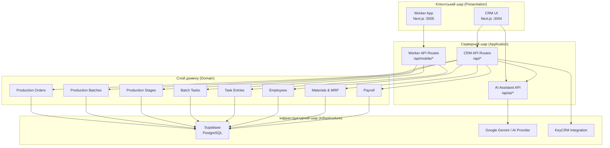
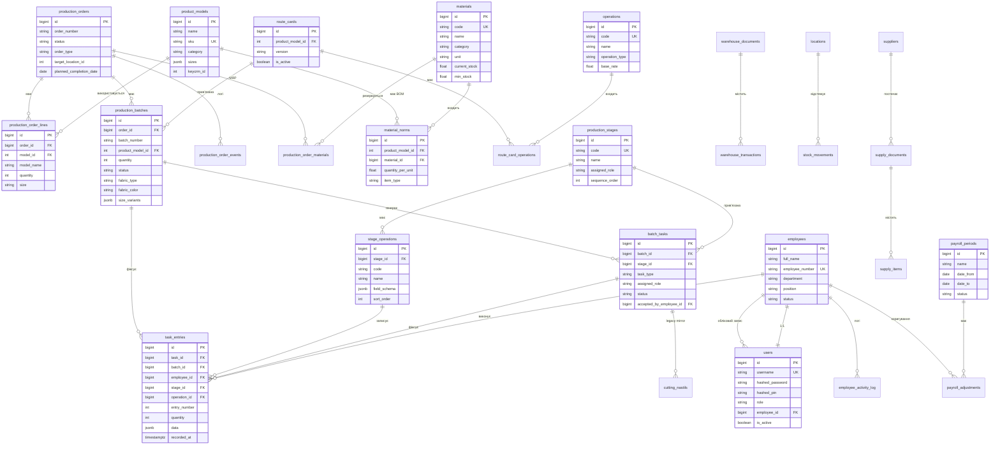
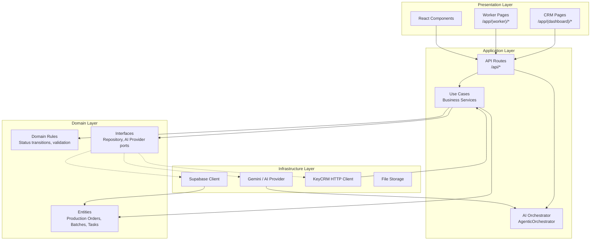

# Архітектура Shveyka MES — Огляд

## 1. Назва системи

Shveyka MES (Manufacturing Execution System) — система управління виробництвом швейної фабрики.

## 2. Мета

Автоматизація повного циклу виробництва: від замовлення до передачі готової продукції на склад. Відстеження партій, операцій, працівників, зарплати та матеріалів.

## 3. Загальна архітектура



## 4. Компоненти системи

| Компонент | Порт | Технологія | Призначення |
|-----------|------|------------|-------------|
| CRM | 3004 | Next.js 15 (App Router) | Планування, управління партіями, аналітика, AI |
| Worker App | 3005 | Next.js 15 (App Router) | Виконання завдань працівниками в цеху |
| Supabase | Cloud | PostgreSQL + Auth + Realtime | База даних, автентифікація, RLS |
| AI Provider | External | Google Gemini / OpenRouter | AI-асистент для аналізу виробництва |

## 5. База даних — схема `shveyka`



## 6. Потік даних (Data Flow)

```mermaid
flowchart LR
    A["Створення замовлення"] --> B["Затвердження"]
    B --> C["Запуск у виробництво"]
    C --> D["Створення партії"]
    D --> E["Запуск партії → Розкрій"]
    E --> F["Працівник виконує операції"]
    F --> G["Майстер підтверджує"]
    G --> H["Перехід на наступний етап"]
    H --> I["Пошив → Оверлок → Прямострочка → Упаковка"]
    I --> J["Партія готова"]
    J --> K["Передача на склад"]
    K --> L["Закриття замовлення"]
```



## 7. Місце в Clean Architecture



### Напрямок залежностей

```
Presentation → Application → Domain ← Infrastructure
```

- **Presentation** залежить від **Application** (викликає API)
- **Application** залежить від **Domain** (використовує сутності та правила)
- **Infrastructure** залежить від **Domain** (реалізує порти)
- **Domain** НЕ залежить ні від кого

## 8. Обмеження та принципи

1. **Суперечності статусів**: Партія не може перейти на наступний етап без підтвердження попереднього
2. **MRP**: Розрахунок матеріалів відбувається при запуску замовлення
3. **Авторизація**: JWT cookie + RLS (частково)
4. **Legacy**: `operation_entries` + `cutting_nastils` співіснують з новою моделлю `task_entries`
5. **KeyCRM**: Синхронізація замовлень через API

## 9. Змінні оточення

| Змінна | Призначення |
|--------|-------------|
| `NEXT_PUBLIC_SUPABASE_URL` | URL Supabase проекту |
| `NEXT_PUBLIC_SUPABASE_ANON_KEY` | Публічний ключ Supabase |
| `SUPABASE_SERVICE_ROLE_KEY` | Сервісний ключ (обходить RLS) |
| `JWT_SECRET` | Секрет для підпису JWT токенів |
| `KEYCRM_API_URL` | URL KeyCRM API |
| `KEYCRM_API_TOKEN` | Токен KeyCRM |
| `GOOGLE_AI_API_KEY` | Ключ Google AI для асистента |
