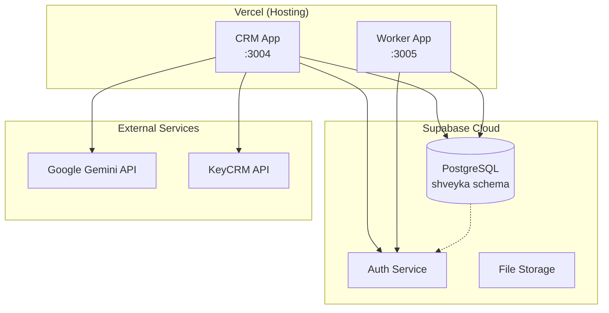

# Інфраструктура Shveyka MES

## 1. Огляд

Система складається з двох Next.js додатків, які використовують спільну базу даних Supabase.

## 2. Архітектура розгортання



## 3. Змінні оточення

### CRM (`.env`)

| Змінна | Опис | Чутлива |
|--------|------|:-------:|
| `NEXT_PUBLIC_SUPABASE_URL` | URL проекту Supabase | Ні |
| `NEXT_PUBLIC_SUPABASE_ANON_KEY` | Публічний ключ | Ні |
| `SUPABASE_SERVICE_ROLE_KEY` | Сервісний ключ (обходить RLS) | **Так** |
| `JWT_SECRET` | Секрет для JWT cookie | **Так** |
| `GOOGLE_AI_API_KEY` | Ключ Google AI | **Так** |
| `KEYCRM_API_URL` | URL KeyCRM API | Ні |
| `KEYCRM_API_TOKEN` | Токен KeyCRM | **Так** |

### Worker App (`.env`)

| Змінна | Опис | Чутлива |
|--------|------|:-------:|
| `NEXT_PUBLIC_SUPABASE_URL` | URL проекту Supabase | Ні |
| `NEXT_PUBLIC_SUPABASE_ANON_KEY` | Публічний ключ | Ні |
| `SUPABASE_SERVICE_ROLE_KEY` | Сервісний ключ | **Так** |
| `JWT_SECRET` | Секрет для JWT cookie | **Так** |

## 4. База даних

### Схема `shveyka`

Основна схема виробничих даних. Містить:
- 20+ таблиць виробничого контуру
- 4+ RPC-функції
- Тригери `touch_updated_at()`

### Схема `public`

Legacy-схема з таблицями:
- `operation_entries` — старі записи операцій

### RLS (Row Level Security)

На даний момент:
- **Серверні API** використовують `SUPABASE_SERVICE_ROLE_KEY` → повний доступ
- **RLS політики не створені** → всі запити через service role
- **Ризик:** Публічні endpoint'и можуть бути вразливі

## 5. Деплой

### Vercel

Обидва додатки розгорнуті на Vercel:

| Додаток | Порт | Репозиторій |
|---------|------|-------------|
| CRM | 3004 | `shveyka_v2-main/crm` |
| Worker App | 3005 | `shveyka_v2-main/worker-app` |

### Локальний запуск

```bash
# CRM
cd crm
npm install
npm run dev  # :3004

# Worker App
cd worker-app
npm install
npm run dev  # :3005
```

## 6. Безпека

### Аутентифікація

- JWT cookie з 7-денним терміном (CRM) або 30-денним (Worker)
- bcrypt для хешування паролів та PIN
- Серверна перевірка ролі в `getAuth()` + `requireAuth()`

### Захист даних

- SUPABASE_SERVICE_ROLE_KEY тільки на сервері
- JWT_SECRET тільки на сервері
- Клієнтські запити через anon key

### Відриті ризики

1. RLS не налаштований → всі запити через service role
2. `* { border-color }` універсальний селектор (виправлено)
3. Сирі помилки БД повертаються клієнту (виправлено)

## 7. Моніторинг

### Логи

- `console.warn` для попереджень (MRP shortages)
- `console.error` для помилок (API exceptions)
- `production_order_events` — бізнес-логи подій
- `employee_activity_log` — логи активності

### Аналітика

- `GET /api/analytics/dashboard` — основний дашборд
- `GET /api/analytics/production-trend` — тренд виробництва
- `GET /api/analytics/employees/top` — топ працівників
- `GET /api/analytics/departments` — статистика по відділах

## 8. Резервне копіювання

- Supabase автоматично бекапить базу
- `request-counter.json` — локальний лічильник API-запитів
- `daily_report_log.json` — логи звітів по хлібу (Poster проект)
