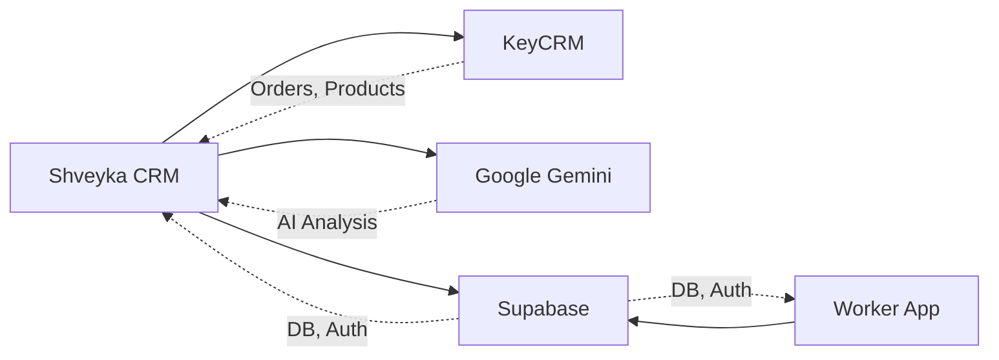
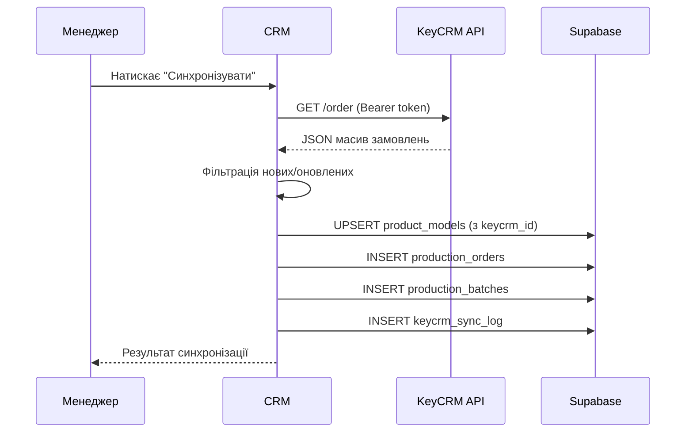
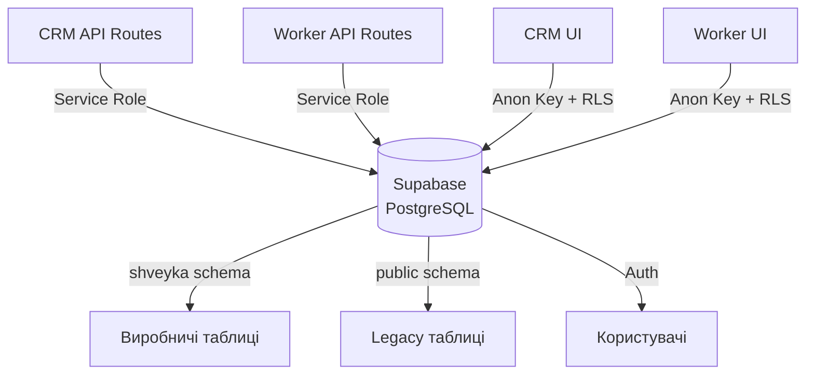
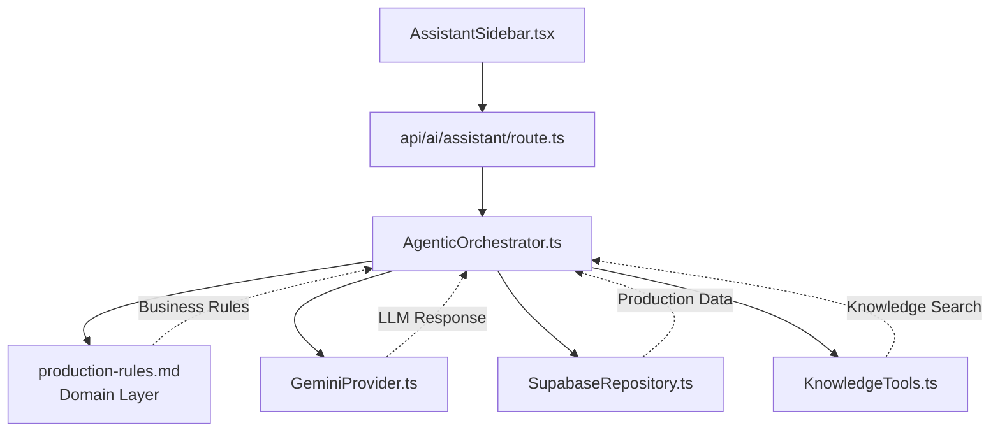
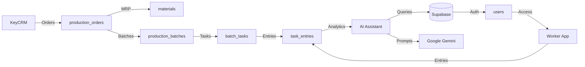

# Інтеграції Shveyka MES

## 1. Огляд

Система інтегрується з трьома зовнішніми сервісами та одним внутрішнім джерелом даних.



## 2. KeyCRM

### 2.1. Назва інтеграції

KeyCRM Order Sync

### 2.2. Джерело та приймач

- **Джерело:** KeyCRM API (`KEYCRM_API_URL/order`)
- **Приймач:** Shveyka CRM (`shveyka.production_orders`, `shveyka.product_models`, `shveyka.production_batches`)

### 2.3. Тип зв'язку

HTTP API pull (CRM запитує KeyCRM)

### 2.4. Формат даних

- **Вхід:** JSON масив замовлень з KeyCRM
- **Обробка:** Кожне замовлення → `production_orders` + `production_order_lines`
- **Продукти:** Автоматичне створення `product_models` з `keycrm_id`

### 2.5. Частота виклику

Вручну через UI або програмно через `POST /api/keycrm/sync`

### 2.6. Авторизація

Bearer token в заголовку: `Authorization: Bearer {KEYCRM_API_TOKEN}`

### 2.7. Retry Policy

- Максимум 3 спроби
- Exponential backoff: 2^attempt + random jitter
- Логування в `shveyka.keycrm_sync_log`

### 2.8. Timeout

30 секунд на запит

### 2.9. Обробка помилок

| Помилка | Дія |
|---------|-----|
| 401 Unauthorized | Логування, сповіщення адміну |
| 429 Rate Limit | Retry з backoff |
| 500 Server Error | Retry з backoff, максимум 3 спроби |
| Timeout | Retry з backoff |

### 2.10. Логування

Кожна синхронізація логується в `shveyka.keycrm_sync_log`:

| Поле | Опис |
|------|------|
| `id` | ID логу |
| `status` | `success` або `error` |
| `orders_fetched` | Кількість отриманих замовлень |
| `batches_created` | Кількість створених партій |
| `products_synced` | Кількість синхронізованих продуктів |
| `error_message` | Текст помилки (якщо є) |
| `synced_at` | Дата синхронізації |

### 2.11. Іменування партій

Композитний формат: `KCM-{orderId}-{productId}` для унікальності.

### 2.12. Схема потоку даних



### 2.13. Контракт інтеграції

**Request:**
```
GET {KEYCRM_API_URL}/order
Authorization: Bearer {KEYCRM_API_TOKEN}
```

**Response (KeyCRM):**
```json
[
  {
    "id": 123,
    "products": [
      {
        "id": 456,
        "name": "Футболка",
        "quantity": 100,
        "price": 250
      }
    ],
    "status": "new",
    "created_at": "2026-04-11T10:00:00Z"
  }
]
```

### 2.14. Файли реалізації

| Файл | Призначення |
|------|-------------|
| `src/app/api/keycrm/sync/route.ts` | Sync endpoint |
| `src/app/api/keycrm/logs/route.ts` | Логи синхронізації |
| `src/services/keycrm.ts` | KeyCRM HTTP клієнт |

## 3. Supabase

### 3.1. Назва інтеграції

Supabase Database + Auth

### 3.2. Джерело та приймач

- **Джерело:** Supabase PostgreSQL
- **Приймач:** Обидва додатки (CRM + Worker)

### 3.3. Тип зв'язку

- **Сервер:** Supabase JS SDK з service role key
- **Клієнт:** Supabase JS SDK з anon key (через RLS)

### 3.4. Формат даних

- PostgreSQL з схемами `shveyka` (основна) та `public` (legacy)
- JSONB для гнучких полів (`size_variants`, `field_schema`, `data`)

### 3.5. Авторизація

| Рівень | Ключ | Доступ |
|--------|------|--------|
| Server API | `SUPABASE_SERVICE_ROLE_KEY` | Повний (обходить RLS) |
| Client UI | `NEXT_PUBLIC_SUPABASE_ANON_KEY` | Обмежений (через RLS) |

### 3.6. Retry Policy

Вбудований в Supabase JS SDK:
- Автоматичний retry при network errors
- Timeout: 30 секунд (налаштовується)

### 3.7. RPC-функції

| Функція | Призначення |
|---------|-------------|
| `calculate_material_requirements(p_order_id)` | MRP розрахунок |
| `log_production_order_event(...)` | Логування подій замовлення |
| `log_production_order_field_change(...)` | Аудит змін полів |
| `touch_updated_at()` | Trigger: оновлення updated_at |

### 3.8. Схема потоку даних



### 3.9. Файли реалізації

| Файл | Призначення |
|------|-------------|
| `src/lib/supabase/server.ts` | Серверний клієнт (service role) |
| `src/lib/supabase/client.ts` | Клієнтський клієнт (anon key) |
| `supabase/migrations/` | SQL міграції |

## 4. Google Gemini / AI Provider

### 4.1. Назва інтеграції

AI Assistant (Gemini Provider)

### 4.2. Джерело та приймач

- **Джерело:** Google Gemini API
- **Приймач:** `AgenticOrchestrator.ts` в CRM

### 4.3. Тип зв'язку

HTTP API push (CRM надсилає запити до Gemini)

### 4.4. Формат даних

- **Вхід:** Prompt з контекстом виробництва + production rules
- **Вихід:** Текстова відповідь + citations

### 4.5. Частота виклику

За запитом користувача (не автоматично)

### 4.6. Авторизація

API key в заголовку: `x-goog-api-key: {GOOGLE_AI_API_KEY}`

### 4.7. Retry Policy

- Максимум 3 спроти
- Exponential backoff
- Timeout: 30 секунд

### 4.8. Обробка помилок

| Помилка | Дія |
|---------|-----|
| 401 Unauthorized | Логування, сповіщення |
| 429 Rate Limit | Retry з backoff |
| 500 Server Error | Retry, fallback на classic mode |
| Timeout | Retry, повідомлення користувачу |

### 4.9. Логування

Запити/відповіді не зберігаються в БД (privacy). Тільки помилки через `console.error`.

### 4.10. Архітектура AI Assistant



### 4.11. Режими роботи

| Режим | Опис | Інструменти |
|-------|------|-------------|
| **Classic** | Прямий запит з контекстом | Жодних |
| **Agentic** | LLM вибирає інструменти | `query_supabase`, `search_knowledge`, `explain_order`, `explain_payroll` |

### 4.12. Формат відповідей (3-30-300)

| Рівень | Довжина | Призначення |
|--------|---------|-------------|
| Headline | ~3 слова | Швидке розуміння |
| Summary | ~30 слів | Контекст |
| Detail | ~300 слів | Повне пояснення |

### 4.13. Файли реалізації

| Файл | Призначення |
|------|-------------|
| `src/lib/ai/agentic/AgenticOrchestrator.ts` | Головний оркестратор |
| `src/lib/ai/agentic/GeminiProvider.ts` | Провайдер LLM |
| `src/lib/ai/agentic/SupabaseRepository.ts` | Доступ до БД |
| `src/lib/ai/agentic/KnowledgeTools.ts` | Інструменти агента |
| `src/lib/ai/agentic/InsightGenerator.ts` | Генерація інсайтів |
| `src/components/AssistantSidebar.tsx` | UI компонент |
| `src/app/api/ai/assistant/route.ts` | API endpoint |

## 5. Залежності між інтеграціями



## 6. Моніторинг інтеграцій

| Інтеграція | Метрика | Де дивитись |
|------------|---------|-------------|
| KeyCRM | `keycrm_sync_log` статус | CRM → KeyCRM → Логи |
| Supabase | Connection errors | Vercel logs, Supabase dashboard |
| Gemini | API response time | `console.error` в логах |

## 7. Обмеження та ризики

| Інтеграція | Обмеження | Ризик |
|------------|-----------|-------|
| KeyCRM | Rate limiting, обмежена документація API | Синхронізація може не повністю відображати зміни |
| Supabase | Service role bypass RLS | Без RLS політик будь-який запит має повний доступ |
| Gemini | Ліміти запитів, вартість | Високе навантаження може перевищити ліміт |
