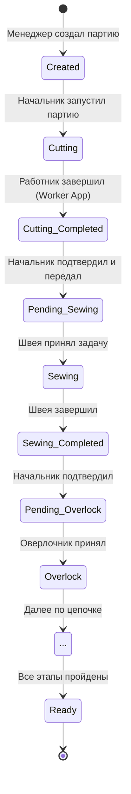

# 📦 Модуль: Batch Management (Управление партиями)

## 13.1. Название модуля
Batch Management (CRM: `/batches`, API: `/api/batches/*`)

## 13.2. Назначение
Управление полным жизненным циклом производственных партий: от создания до завершения производства. Обеспечение перехода между этапами через ручное подтверждение (Stage-Gate).

## 13.3. Бизнес-цель
1.  Контролировать ход выполнения заказов в реальном времени.
2.  Гарантировать проверку качества на каждом этапе перед передачей дальше.
3.  Автоматически начислять зарплату сотрудникам за подтвержденную работу.
4.  Передавать технические параметры (нитки, узоры) следующему этапу.

## 13.4. Где используется
*   **Пользователи:** Менеджер (создание), Начальник пр-ва (подтверждение), Швеи/Раскройщики (исполнение через Worker App).
*   **Экраны:** Список партий (`/batches`), Детальная карточка (`/batches/[id]`), Worker App (список задач).

## 13.5. Входные данные
*   **Создание:** Модель, количество, ткань, цвет, размеры.
*   **Передача этапа:** Статус записей (approval), параметры следующего этапа (цвет нити, тип вышивки).
*   **Worker:** Факт выполнения (количество, брак, время).

## 13.6. Выходные данные
*   Обновленный статус партии (`cutting` -> `sewing` -> ...).
*   Созданная задача (`batch_task`) для следующей роли.
*   Начисленная зарплата (`payroll_accruals`).
*   Лог действий (`system_logs`).

## 13.7. Зависимости
### Таблицы БД
*   `production_batches` (основная сущность)
*   `batch_tasks` (задачи для работников)
*   `task_entries` (факт выработки)
*   `payroll_accruals` (зарплата)
*   `stage_operations` (справочник операций и ставок)

### API
*   `GET /api/batches` (список)
*   `POST /api/batches` (создание)
*   `POST /api/batches/:id/transfer` (ключевая логика перехода)

## 13.8. Mermaid-схема (State Diagram)

## 13.9. Место в Clean Architecture
*   **Entity:** `ProductionBatch` (структура данных, статусы).
*   **Use Case:** `TransferStageUseCase` (валидация -> апрув записей -> начисление ЗП -> создание новой задачи).
*   **Interface (Port):** `BatchRepository` (методы: `findById`, `updateStatus`, `getEntries`).
*   **Adapter:** `POST /api/batches/[id]/transfer` (Next.js Route Handler).
*   **Infrastructure:** Supabase Client (PostgreSQL), Logger (`appLogger`).

## 13.10. Ограничения и риски
*   **Необратимость:** После подтверждения этапа и начисления ЗП откатить действие сложно (требуется ручная корректировка через админку).
*   **Блокировка:** Нельзя удалить партию, если у неё есть записи выработки (`task_entries`).
*   **Конкурентность:** При одновременном подтверждении одним начальником с двух устройств возможна гонка данных (сейчас mitigated через `submitted` -> `approved` update only).

## 13.11. Связанные документы
*   [ADR-001: Stage-Gate Workflow](../adr/ADR-001-stage-gate-workflow.md)
*   [API Spec: Batches](../api/01-openapi-spec.md#1-batches-партии)
*   [Glossary](../glossary/README.md#1-основные-сущности)
