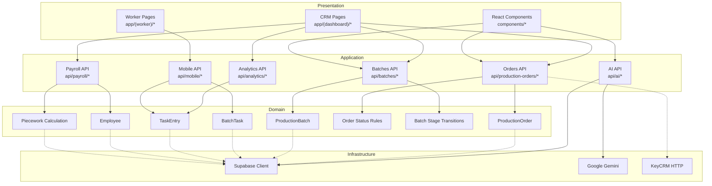

# Огляд модулів Shveyka MES

## 1. CRM — Основний додаток

### 1.1. Production Orders (Виробничі замовлення)

**Призначення:** Управління повним життєвим циклом виробничих замовлень.

**Бізнес-ціль:** Забезпечити контроль від створення замовлення до передачі готової продукції на склад.

**Користувачі:** Менеджер, Admin

**Вхідні дані:**
- Модель продукту, кількість, клієнт
- Тип замовлення (stock/customer)

**Вихідні дані:**
- Замовлення зі статусом
- Лінії замовлення
- MRP розрахунок

**Залежності:**
- `production_orders`, `production_order_lines`, `production_order_events`, `production_order_materials`
- RPC: `calculate_material_requirements()`, `log_production_order_event()`

**Місце в Clean Architecture:**
- **Entity:** ProductionOrder
- **Use Case:** CreateOrder, ApproveOrder, LaunchOrder, CompleteOrder
- **Adapter:** API Routes `/api/production-orders/*`
- **Infrastructure:** Supabase Client

### 1.2. Production Batches (Партії)

**Призначення:** Управління виробничими партіями — основна одиниця виробництва.

**Бізнес-ціль:** Розбити замовлення на конкретні партії для виконання в цеху.

**Користувачі:** Начальник виробництва, Admin, Manager, Master

**Вхідні дані:**
- Модель, кількість, тканина, кольори, розміри

**Вихідні дані:**
- Партія зі статусом
- Batch tasks для кожного етапу

**Залежності:**
- `production_batches`, `batch_tasks`, `task_entries`, `cutting_nastils`
- `production_stages`, `stage_operations`

### 1.3. Analytics (Аналітика)

**Призначення:** Дашборд з KPI виробництва.

**Бізнес-ціль:** Надати менеджеру огляд поточного стану виробництва.

**Вхідні дані:** Період (today/week/month)

**Вихідні дані:**
- Активні партії, працівники
- Загальний виробіток, заробіток
- Топ працівників
- Денна розбивка

**⚠️ Відомий баг:** Читає з `operation_entries` замість `task_entries` (див. ADR-001)

### 1.4. Payroll (Зарплата)

**Призначення:** Розрахунок відрядної зарплати працівників.

**Бізнес-ціль:** Автоматичний розрахунок на основі виробітку × ставка.

**⚠️ Відомий баг:** Читає з `operation_entries` замість `task_entries` (див. ADR-001)

### 1.5. Employees (Персонал)

**Призначення:** Довідник працівників, посади, графіки, відвідуваність.

**Бізнес-ціль:** Управління персоналом виробництва.

### 1.6. AI Assistant

**Призначення:** Інтелектуальний помічник для аналізу виробництва.

**Режими:**
- **Classic:** Прямий запит до LLM з контекстом
- **Agentic:** Використовує інструменти (Supabase query, knowledge search)

**Архітектура (Clean Architecture):**
- **Presentation:** `AssistantSidebar.tsx`, `api/ai/assistant/route.ts`
- **Application:** `AgenticOrchestrator.ts`
- **Domain:** `production-rules.md` (бізнес-правила)
- **Infrastructure:** `GeminiProvider`, `SupabaseRepository`, `KnowledgeTools`

## 2. Worker App — Мобільний додаток цеху

### 2.1. Task Execution

**Призначення:** Виконання завдань працівниками в цеху.

**Бізнес-ціль:** Фіксувати виробіток кожного працівника по операціях.

**Користувачі:** Працівники з ролями (cutting, sewing, overlock, etc.)

**Вхідні дані:**
- Employee number + PIN + password
- Заповнені поля операції (динамічна форма з field_schema)

**Вихідні дані:**
- `task_entries` — записи виконання
- `cutting_nastils` — legacy для розкрою
- `employee_activity_log` — аудит

### 2.2. Master Approval

**Призначення:** Підтвердження записів працівників майстром.

**Бізнес-ціль:** Контроль якості перед переходом на наступний етап.

## 3. Інтеграції

### 3.1. KeyCRM

**Призначення:** Синхронізація замовлень з KeyCRM.

**Тип:** HTTP API pull

**Частота:** Вручну або за розкладом

**Дані:** Замовлення → production_orders + production_batches

### 3.2. Supabase

**Призначення:** Основна база даних + автентифікація.

**Тип:** PostgreSQL + Auth + Realtime

### 3.3. Google Gemini / AI Provider

**Призначення:** AI-асистент для аналізу виробництва.

**Тип:** HTTP API

## 4. Місце в Clean Architecture (повна система)



## 5. Напрямок залежностей

```
Presentation → Application → Domain ← Infrastructure
```

Кожен шар залежить тільки від шару всередині (до Domain). Domain не залежить ні від кого. Infrastructure реалізує порти, визначені в Domain.
