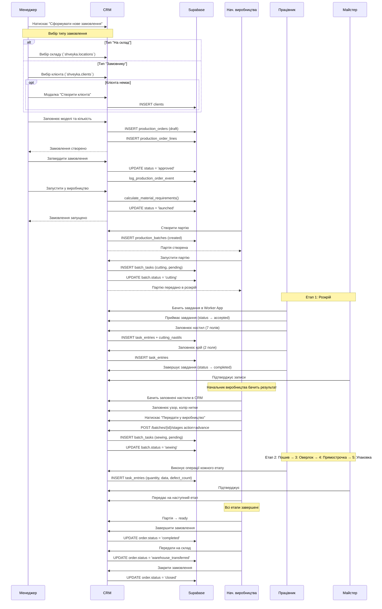

# Процес виробництва — Повний потік

## 1. Назва процесу

Повний цикл виробництва: від замовлення до передачі на склад.

## 2. Мета

Автоматизувати та відстежити весь виробничий процес швейної продукції: створення замовлення, формування партій, виконання етапів працівниками, контроль якості, передача готової продукції.

## 3. Триггер запуску

Менеджер створює виробниче замовлення в CRM або замовлення синхронізується з KeyCRM.

## 4. Учасники

| Роль | Дія |
|------|-----|
| Менеджер / Admin | Створення, затвердження, запуск замовлення |
| Начальник виробництва | Створення партій, запуск в розкрій, контроль процесу |
| Працівник розкрою | Виконання операцій настилу та крою |
| Працівник пошиву | Виконання операцій пошиву |
| Працівник оверлоку | Виконання операцій оверлоку |
| Працівник прямострочки | Виконання операцій прямострочки |
| Працівник розпошиву | Виконання операцій розпошиву |
| Працівник упаковки | Упаковка, відбраковка, передача на склад |
| Майстер | Підтвердження записів працівників |

## 5. Вхідні дані

- Модель продукту (`product_models`)
- Кількість замовлення
- Специфікація матеріалів (`material_norms`)

## 6. Кроки виконання

## 7. Етапи виробництва

| # | Етап | Код | Роль | Операції | Форма працівника |
|---|------|-----|------|----------|-----------------|
| 1 | Розкрій | `cutting` | cutting | настил, крій | 7 полів (настил) + 2 поля (крій) |
| 2 | Пошив | `sewing` | sewing | зшивання | кількість, брак |
| 3 | Оверлок | `overlock` | overlock | оверлок | кількість, брак |
| 4 | Прямострочка | `straight_stitch` | straight | прямострочка | кількість, брак |
| 5 | Розпошив | `coverlock` | coverlock | розпошив | кількість, брак |
| 6 | Упаковка | `packaging` | packaging | упаковка | тип, кількість |

## 8. Точки прийняття рішень

| Точка | Умова | Дія |
|-------|-------|-----|
| MRP перевірка | Є дефіцит матеріалів | Попередження, але запуск дозволено |
| Запуск партії | Вже є активне завдання | Блокування — не можна запустити вдруге |
| Завершення замовлення | Не всі партії готові | Блокування — треба завершити всі партії |
| Передача на склад | Статус не `completed` | Блокування |
| Закриття замовлення | Статус не `warehouse_transferred` | Блокування |

## 9. Створювані сутності

1. `production_orders` — замовлення
2. `production_order_lines` — позиції
3. `production_order_events` — аудит-лог подій
4. `production_order_materials` — MRP знімок
5. `production_batches` — партії
6. `batch_tasks` — завдання на етап
7. `task_entries` — записи виконання
8. `cutting_nastils` — legacy-дзеркало настилів
9. `employee_activity_log` — активність працівників

## 10. Вихідний результат

- Готова продукція на складі
- Повний аудит-лог виробництва
- Дані для розрахунку зарплати
- Аналітика виробітку

## 11. Помилки

| Помилка | Коли виникає | Що робити |
|---------|-------------|-----------|
| "Створити партію можна лише для approved/launched/in_production" | Замовлення в draft | Спочатку затвердити замовлення |
| "Запуск можливий лише для партії у статусі created" | Партія вже запущена | Не запускати повторно |
| "Для цієї партії вже існує активне завдання розкрою" | Дубльований запуск | Перевірити існуюче завдання |
| "Неможливо завершити замовлення: не всі партії готові" | Є партії не в ready/closed/shipped | Завершити всі партії |
| "Передати на склад можна лише після завершення" | Замовлення не completed | Спочатку завершити замовлення |

## 12. Залежності

| Залежність | Тип | Використання |
|------------|-----|-------------|
| `shveyka.production_orders` | Таблиця | Верхньорівневе замовлення |
| `shveyka.production_batches` | Таблиця | Виробнича партія |
| `shveyka.batch_tasks` | Таблиця | Завдання на етап |
| `shveyka.task_entries` | Таблиця | Канонічний лог виконання |
| `shveyka.production_stages` | Таблиця | Довідник етапів |
| `shveyka.stage_operations` | Таблиця | Операції + field_schema |
| `shveyka.cutting_nastils` | Таблиця | Legacy-дзеркало для сумісності |
| `shveyka.employee_activity_log` | Таблиця | Аудит активності |
| `storage.getMoves` | API Poster | Переміщення на склад списання |
| `storage.getWastes` | API Poster | Ручні списання |

## 13. API/Функції

| Endpoint | Метод | Призначення |
|----------|-------|-------------|
| `POST /api/production-orders` | POST | Створити замовлення |
| `POST /api/production-orders/{id}/approve` | POST | Затвердити |
| `POST /api/production-orders/{id}/launch` | POST | Запустити |
| `POST /api/production-orders/{id}/batches` | POST | Створити партію |
| `POST /api/batches/{id}/launch` | POST | Запустити партію → розкрій |
| `POST /api/batches/{id}/stages` | POST | Перехід на наступний етап |
| `POST /api/mobile/tasks/{id}/entries` | POST | Запис працівника |
| `POST /api/mobile/master/approve` | POST | Підтвердження майстром |
| `POST /api/production-orders/{id}/complete` | POST | Завершити замовлення |
| `POST /api/production-orders/{id}/transfer_to_warehouse` | POST | Передати на склад |
| `POST /api/production-orders/{id}/close` | POST | Закрити замовлення |
