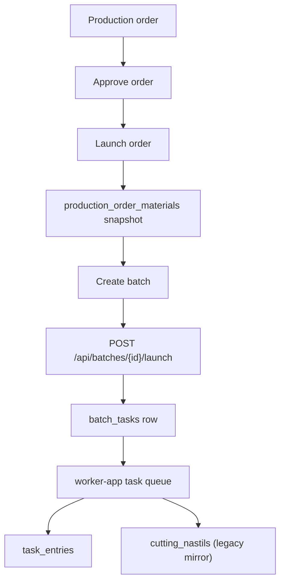
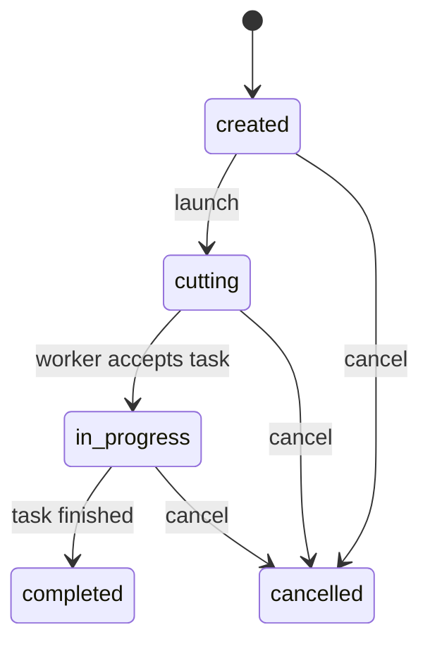
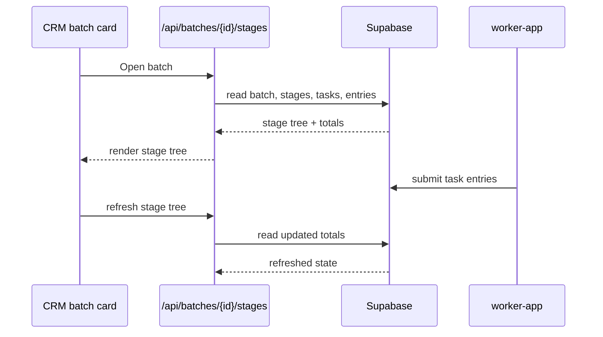

# Manufacturing Process

This document describes the current production workflow implemented in Shveyka.

## Source of truth

- BOM data lives in `shveyka.product_models` and `shveyka.material_norms`.
- Material planning snapshots live in `shveyka.production_order_materials`.
- Route cards describe operations only.
- Production batches are launched manually from the CRM batch card.
- Worker execution is recorded in `shveyka.task_entries`.
- Cutting keeps a compatibility mirror in `shveyka.cutting_nastils`.

## Current flow

1. Create a production order in the CRM app.
2. Approve the order.
3. Launch the order when it is ready for execution.
4. Calculate material requirements and store the snapshot.
5. Create a batch manually from the order.
6. Launch the batch to create a `batch_tasks` row.
7. Worker-app consumes the task.
8. Workers record entries and, for cutting, nastils.
9. CRM shows the stage tree, task history, and entry totals from the shared DB.

## Batch lifecycle

## Task lifecycle

- `pending` - task was created but not accepted yet.
- `accepted` - worker claimed the task.
- `in_progress` - worker started recording entries.
- `completed` - work on the task is done.
- `cancelled` - task is stopped and should not receive more entries.

## What the batch card shows

- batch number and status
- product model and quantity
- stage tree from `GET /api/batches/{id}/stages`
- active task for each stage
- recorded entries per stage
- current stage, next stage, and completion summary

## Compatibility notes

- `route_cards` remain a separate planning artifact.
- `stage_operations` define the worker form schema.
- Cutting still supports legacy nastil data, but the canonical execution log is
  `task_entries`.
- The CRM and worker apps must agree on schema boundaries:
  - `shveyka` for core application data
  - `public` only for legacy/shared data
