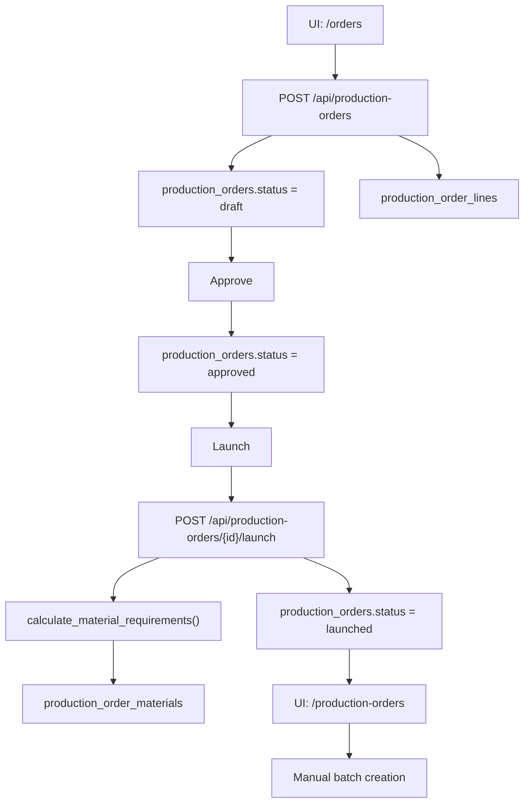
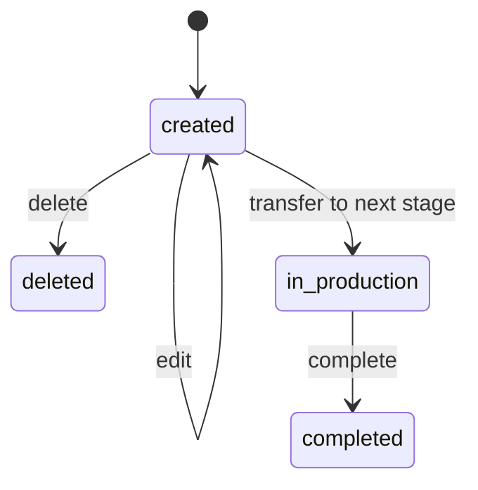
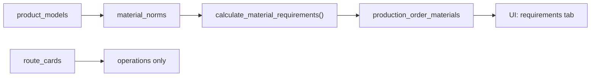
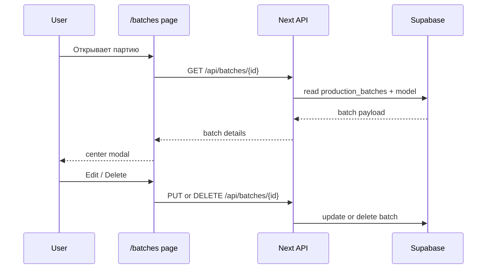
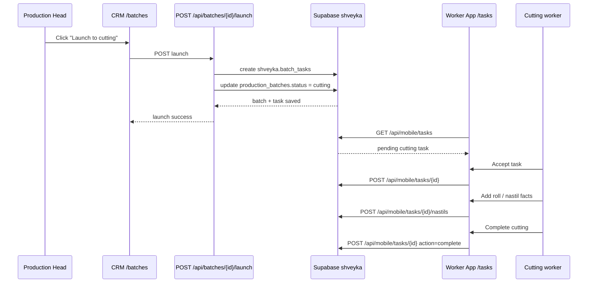
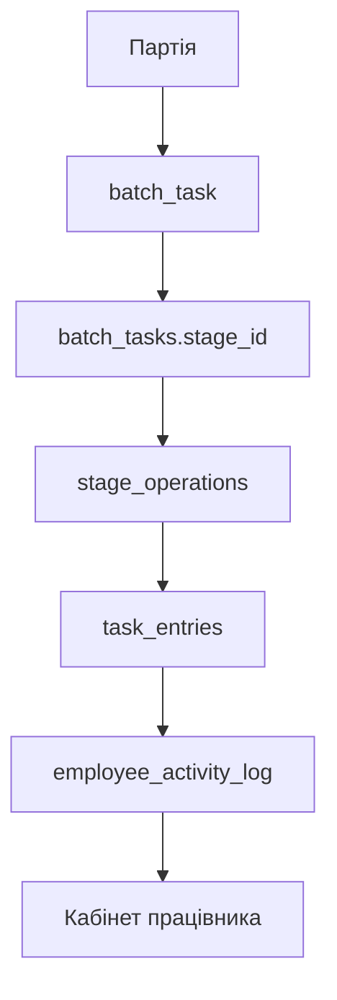

# Производственный процесс

Этот документ фиксирует текущий поток в `crm` для схемы `shveyka`.

## Источник истины

- BOM хранится в `product_models` и `material_norms`.
- MRP-снимок по заказу хранится в `production_order_materials`.
- Маршрутные карты используются только для операций и технологического маршрута.
- Производственные партии создаются вручную внутри карточки заказа.

## Текущий поток

1. Заказ создается в разделе `Замовлення`.
2. Форма вызывает `POST /api/production-orders`.
3. В базе создаются:
   - `production_orders` со статусом `draft`
   - `production_order_lines`
4. Заказ подтверждается и становится `approved`.
5. Действие `Запустити у виробництво` переводит заказ в `launched`.
6. При запуске выполняется расчет потребности по BOM.
7. Снимок потребности сохраняется в `production_order_materials`.
8. Партии не создаются автоматически.
9. Партии создаются вручную в карточке `Виробниче замовлення`.
10. Партия редактируется и удаляется только в статусе `created`.

## Mermaid: поток заказа

## Mermaid: жизненный цикл партии

## Mermaid: BOM и MRP

## Карточка партии

В карточке партии сейчас фиксируются:

- модель заказа
- дата формирования
- ткань
- цвета ткани и количество рулонов по каждому цвету
- выбранные размеры модели
- примечания

## Правила редактирования

- Запущенный заказ можно перевести в `launched`, даже если материалы уходят в минус.
- Партии редактируются и удаляются только пока их статус `created`.
- После передачи партии на следующий этап она становится частью производственного потока.

## Отдельно по `route_cards`

- `route_cards` не хранят BOM.
- `route_cards` не участвуют в расчете потребности.
- `route_cards` нужны только как задел под операции и технологический маршрут.

## Связанные экраны

- [src/app/(dashboard)/orders/page.tsx](/D:/Швейка/crm/src/app/%28dashboard%29/orders/page.tsx)
- [src/app/(dashboard)/production-orders/page.tsx](/D:/Швейка/crm/src/app/%28dashboard%29/production-orders/page.tsx)
- [src/app/(dashboard)/production-orders/[id]/page.tsx](/D:/Швейка/crm/src/app/%28dashboard%29/production-orders/%5Bid%5D/page.tsx)
- [src/app/(dashboard)/batches/page.tsx](/D:/Швейка/crm/src/app/%28dashboard%29/batches/page.tsx)

## Mermaid: просмотр партии

## Mermaid: handoff to cutting

## Employee Access

- CRM manages the employee directory in `shveyka.employees`.
- `shveyka.users` stores worker-app credentials separately from the employee profile.
- Worker login requires `employee_number + PIN + password`.
- The assigned role controls which tasks are visible in the mobile app.
- When an employee is deactivated, the linked worker access is disabled too.
- The CRM staff list hides employees with `status = dismissed` by default; the record remains available in the database for audit and history.

## Positions Directory

- Employee forms use `shveyka.positions` as the source of truth for the `Посада` field.
- The CRM positions screen at `/employees/positions` lets HR add, edit, and retire positions.
- New employees and employee edits must choose a position from the list instead of entering it manually.
- If `shveyka.positions` is missing during deployment, the UI falls back to the seeded positions list until the migration is applied.

## Stage → Operation → Entry

- The next production model splits work into stage, operation, and entry.
- A stage is the top-level manufacturing step, such as `Розкрій` or `Пошив`.
- An operation is a concrete task inside a stage, such as `Настил` or `Зшивання`.
- An entry is one worker submission for that operation, stored as structured JSON plus audit metadata.
- The employee cabinet can later aggregate entries into a timeline per stage and per batch.
- `batch_tasks.stage_id` is the source of truth for the task stage.
- `assigned_role` remains only as a compatibility field during the transition window.
- `GET /api/mobile/stages` feeds the worker UI with active stages and their operations.
- `POST /api/mobile/tasks/{id}/entries` stores one operation entry and mirrors cutting nastil data for backward compatibility.
- `GET /api/batches/{id}/stages` returns the full stage tree for the CRM batch card.
- The CRM batch card opens as a centered modal overlay; clicking a stage row opens a dedicated stage modal on top of the batch modal.
- For `cutting`, the CRM drill-in can open a dedicated nastil modal from the stage modal so the batch flow shows the actual rolls that were entered by the worker.
- The nastil modal renders the order size grid from the batch order/model sizes, and each size cell shows the count for that roll.
- `POST /api/batches/{id}/stages` creates the next stage task after the current stage is completed.
- The worker page renders fields from `stage_operations.field_schema`; adding a new operation is a data change, not a UI rewrite.

- `production_batches.status` uses `shveyka.batch_status`; later-stage values are stored in the same schema, not in `public`.
