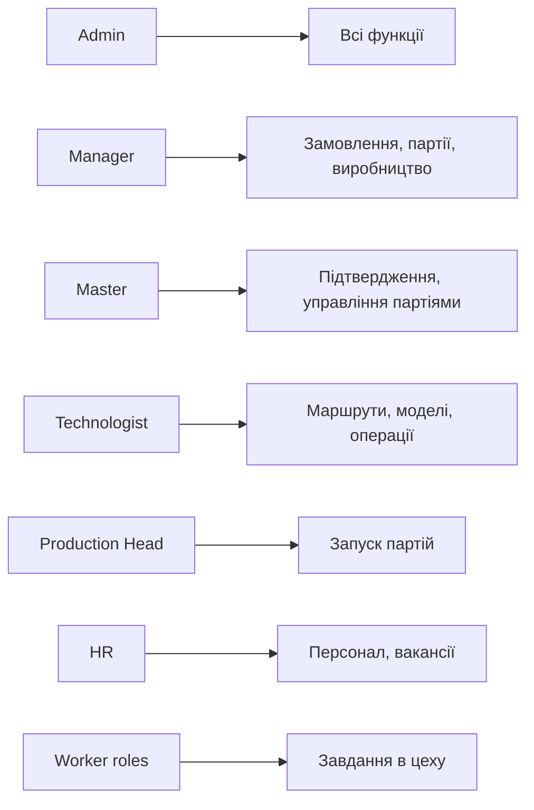

# Ролі та права доступу

## 1. Огляд

Система використовує role-based access control (RBAC) на основі JWT cookie. Кожен користувач має одну роль, яка визначає доступні функції.

## 2. Матриця прав доступу

### Детальна матриця

| Функція | admin | manager | master | technologist | production_head | hr | cutting | sewing | overlock | packaging |
|---------|:-----:|:-------:|:------:|:------------:|:---------------:|:--:|:-------:|:------:|:--------:|:---------:|
| Дашборд | ✅ | ✅ | ❌ | ❌ | ❌ | ❌ | ❌ | ❌ | ❌ | ❌ |
| Замовлення | ✅ | ✅ | ❌ | ❌ | ❌ | ❌ | ❌ | ❌ | ❌ | ❌ |
| Вир. замовлення | ✅ | ✅ | ❌ | ❌ | ❌ | ❌ | ❌ | ❌ | ❌ | ❌ |
| Партії | ✅ | ✅ | ✅ | ❌ | ✅ | ❌ | ❌ | ❌ | ❌ | ❌ |
| Маршрути | ✅ | ✅ | ❌ | ✅ | ❌ | ❌ | ❌ | ❌ | ❌ | ❌ |
| Працівники | ✅ | ✅ | ❌ | ❌ | ❌ | ✅ | ❌ | ❌ | ❌ | ❌ |
| Підтвердження | ✅ | ✅ | ✅ | ❌ | ❌ | ❌ | ❌ | ❌ | ❌ | ❌ |
| Аналітика | ✅ | ✅ | ❌ | ❌ | ❌ | ❌ | ❌ | ❌ | ❌ | ❌ |
| KeyCRM | ✅ | ❌ | ❌ | ❌ | ❌ | ❌ | ❌ | ❌ | ❌ | ❌ |
| Склад | ✅ | ✅ | ❌ | ❌ | ❌ | ❌ | ❌ | ❌ | ❌ | ❌ |
| Постачання | ✅ | ✅ | ❌ | ❌ | ❌ | ❌ | ❌ | ❌ | ❌ | ❌ |
| Дефекти | ✅ | ✅ | ✅ | ❌ | ❌ | ❌ | ❌ | ❌ | ❌ | ❌ |
| Операції | ✅ | ✅ | ❌ | ❌ | ❌ | ❌ | ❌ | ❌ | ❌ | ❌ |
| Нарахування ЗП | ✅ | ✅ | ❌ | ❌ | ❌ | ❌ | ❌ | ❌ | ❌ | ❌ |
| Рух коштів | ✅ | ✅ | ❌ | ❌ | ❌ | ❌ | ❌ | ❌ | ❌ | ❌ |
| Платежі | ✅ | ✅ | ❌ | ❌ | ❌ | ❌ | ❌ | ❌ | ❌ | ❌ |
| Вакансії | ✅ | ✅ | ❌ | ❌ | ❌ | ✅ | ❌ | ❌ | ❌ | ❌ |
| Кандидати | ✅ | ✅ | ❌ | ❌ | ❌ | ✅ | ❌ | ❌ | ❌ | ❌ |
| Навчання | ✅ | ✅ | ❌ | ❌ | ❌ | ✅ | ❌ | ❌ | ❌ | ❌ |
| Матеріали | ✅ | ✅ | ❌ | ❌ | ❌ | ✅ | ❌ | ❌ | ❌ | ❌ |
| Worker: Завдання | ❌ | ❌ | ❌ | ❌ | ❌ | ❌ | ✅ | ✅ | ✅ | ✅ |

## 3. Аутентифікація

### CRM
- **Метод**: username + password → JWT cookie (`mes_auth_token`)
- **Термін**: 7 днів
- **Перевірка**: `getAuth()` на сервері + `requireAuth(roles)` для мутацій

### Worker App
- **Метод**: employee_number + PIN + password → JWT cookie (`mes_worker_token`)
- **Термін**: 30 днів
- **Перевірка**: Валідація через `shveyka.users` + `shveyka.employees`

## 4. Row Level Security (RLS)

На даний момент:
- **Серверні API** використовують `SUPABASE_SERVICE_ROLE_KEY` → обходять RLS
- **Клієнтські запити** потенційно захищені RLS, але політики не створені
- **План**: Додати RLS політики для публічних endpoint'ів

## 5. Файли реалізації

| Файл | Призначення |
|------|-------------|
| `src/lib/auth-server.ts` | Серверна перевірка JWT та ролей |
| `src/middleware.ts` | Middleware для захисту роутів |
| `src/lib/supabase/server.ts` | Supabase клієнт з service role |
| `worker-app/src/lib/auth-server.ts` | Worker автентифікація |
| `src/app/api/auth/login/route.ts` | CRM login endpoint |
| `worker-app/src/app/api/mobile/auth/login/route.ts` | Worker login endpoint |

## 6. Таблиця `shveyka.users`

| Колонка | Тип | Опис |
|---------|-----|------|
| `id` | bigint PK | ID користувача |
| `username` | text UK | Логін |
| `hashed_password` | text | bcrypt хеш пароля |
| `hashed_pin` | text | bcrypt хеш PIN-коду |
| `role` | text | Роль користувача |
| `employee_id` | bigint FK | Посилання на `shveyka.employees` |
| `is_active` | boolean | Активний користувач чи ні |

## 7. Обмеження

1. Один користувач = одна роль
2. Роль не можна змінити без перезаймання (перезапис cookie)
3. `production_head` має право запускати партії, але не може створювати замовлення
4. `master` може підтверджувати записи працівників і керувати партіями
5. Worker-ролі (`cutting`, `sewing`, тощо) бачать тільки завдання свого типу
