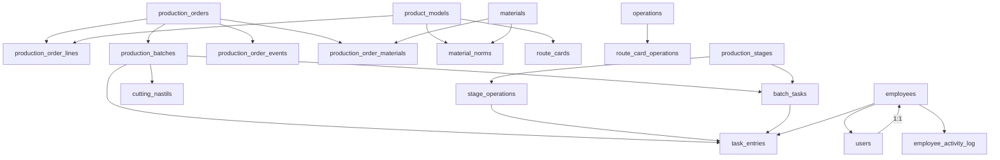

# Схеми даних — PostgreSQL `shveyka`

## 1. Огляд

Схема `shveyka` містить всі виробничі таблиці. Схема `public` містить legacy-таблиці (`operation_entries`).

## 2. Таблиці виробничого контуру

### production_orders

| Колонка | Тип | Обмеження | Опис |
|---------|-----|-----------|------|
| `id` | bigint | PK | ID замовлення |
| `order_number` | text | UNIQUE | Номер замовлення (автоматичний) |
| `order_type` | text | NOT NULL | `stock` або `customer` |
| `customer_name` | text | | Назва клієнта |
| `customer_phone` | text | | Телефон клієнта |
| `customer_email` | text | | Email клієнта |
| `status` | text | NOT NULL | Поточний статус |
| `target_location_id` | bigint | FK → locations | Цільове розташування |
| `priority` | text | | `low`, `normal`, `high`, `urgent` |
| `planned_completion_date` | date | | Планова дата завершення |
| `actual_start_date` | date | | Фактична дата початку |
| `actual_completion_date` | date | | Фактична дата завершення |
| `approved_by` | bigint | FK → users | Хто затвердив |
| `approved_at` | timestamptz | | Дата затвердження |
| `launched_by` | bigint | FK → users | Хто запустив |
| `launched_at` | timestamptz | | Дата запуску |
| `completed_by` | bigint | FK → users | Хто завершив |
| `completed_at` | timestamptz | | Дата завершення |
| `warehouse_transferred_by` | bigint | FK → users | Хто передав на склад |
| `warehouse_transferred_at` | timestamptz | | Дата передачі на склад |
| `notes` | text | | Примітки |
| `warehouse_transfer_notes` | text | | Примітки до передачі |
| `created_at` | timestamptz | DEFAULT now() | Дата створення |
| `updated_at` | timestamptz | DEFAULT now() | Дата оновлення |

### production_order_lines

| Колонка | Тип | Обмеження | Опис |
|---------|-----|-----------|------|
| `id` | bigint | PK | ID позиції |
| `order_id` | bigint | FK → production_orders | ID замовлення |
| `model_id` | bigint | FK → product_models | Модель |
| `model_name` | text | | Назва моделі (денормалізація) |
| `model_sku` | text | | SKU моделі |
| `quantity` | integer | | Кількість |
| `size` | text | | Розмір |
| `notes` | text | | Примітки |

### production_batches

| Колонка | Тип | Обмеження | Опис |
|---------|-----|-----------|------|
| `id` | bigint | PK | ID партії |
| `order_id` | bigint | FK → production_orders | ID замовлення |
| `batch_number` | text | | Номер партії |
| `product_model_id` | bigint | FK → product_models | Модель продукту |
| `sku` | text | | SKU |
| `quantity` | integer | NOT NULL | Кількість |
| `status` | text | NOT NULL | Статус партії |
| `priority` | text | | Пріоритет |
| `fabric_type` | text | | Тип тканини |
| `fabric_color` | text | | Колір тканини |
| `size_variants` | jsonb | | Варіанти розмірів |
| `route_card_id` | bigint | FK → route_cards | Маршрутна карта |
| `supervisor_id` | bigint | FK → employees | Відповідальний |
| `is_urgent` | boolean | DEFAULT false | Термінова |
| `planned_start_date` | date | | Планова дата початку |
| `planned_end_date` | date | | Планова дата завершення |
| `actual_start_date` | date | | Фактична дата початку |
| `actual_end_date` | date | | Фактична дата завершення |
| `notes` | text | | Примітки |
| `keycrm_id` | text | | ID з KeyCRM |
| `source_order` | text | | Джерело замовлення |
| `client_name` | text | | Назва клієнта |
| `thread_number` | text | | Номер нитки |
| `embroidery_type` | text | | Тип вишивки |
| `embroidery_color` | text | | Колір вишивки |
| `nastyl_number` | integer | | Номер настилу |
| `created_at` | timestamptz | DEFAULT now() | Дата створення |
| `updated_at` | timestamptz | DEFAULT now() | Дата оновлення |

### production_stages

| Колонка | Тип | Обмеження | Опис |
|---------|-----|-----------|------|
| `id` | bigint | PK | ID етапу |
| `code` | text | UNIQUE | Код етапу (cutting, sewing...) |
| `name` | text | NOT NULL | Назва етапу |
| `assigned_role` | text | NOT NULL | Призначена роль |
| `sequence_order` | integer | DEFAULT 0 | Порядок у конвеєрі |
| `color` | text | | Колір для UI |
| `is_active` | boolean | DEFAULT true | Активний чи ні |
| `created_at` | timestamptz | DEFAULT now() | |
| `updated_at` | timestamptz | DEFAULT now() | |

#### Існуючі етапи

| seq | code | name | assigned_role |
|-----|------|------|---------------|
| 10 | cutting | Розкрій | cutting |
| 20 | sewing | Пошив | sewing |
| 30 | overlock | Оверлок | overlock |
| 40 | straight_stitch | Прямострочка | straight |
| 50 | coverlock | Розпошив | coverlock |
| 60 | packaging | Упаковка | packaging |

### stage_operations

| Колонка | Тип | Обмеження | Опис |
|---------|-----|-----------|------|
| `id` | bigint | PK | ID операції |
| `stage_id` | bigint | FK → production_stages | ID етапу |
| `code` | text | NOT NULL | Код операції |
| `name` | text | NOT NULL | Назва операції |
| `field_schema` | jsonb | NOT NULL DEFAULT '[]' | JSON-схема форми працівника |
| `sort_order` | integer | DEFAULT 0 | Порядок сортування |
| `is_active` | boolean | DEFAULT true | Активна чи ні |
| `created_at` | timestamptz | DEFAULT now() | |
| `updated_at` | timestamptz | DEFAULT now() | |

### batch_tasks

| Колонка | Тип | Обмеження | Опис |
|---------|-----|-----------|------|
| `id` | bigint | PK | ID завдання |
| `batch_id` | bigint | FK → production_batches | ID партії |
| `stage_id` | bigint | FK → production_stages | ID етапу |
| `task_type` | text | | Тип завдання |
| `assigned_role` | text | | Призначена роль |
| `status` | text | NOT NULL | Статус завдання |
| `accepted_by_employee_id` | bigint | FK → employees | Хто прийняв |
| `launched_by_user_id` | bigint | FK → users | Хто запустив |
| `launched_at` | timestamptz | | Дата запуску |
| `completed_at` | timestamptz | | Дата завершення |
| `notes` | text | | Примітки |
| `created_at` | timestamptz | DEFAULT now() | |
| `updated_at` | timestamptz | DEFAULT now() | |

### task_entries

| Колонка | Тип | Обмеження | Опис |
|---------|-----|-----------|------|
| `id` | bigint | PK | ID запису |
| `task_id` | bigint | FK → batch_tasks | ID завдання |
| `batch_id` | bigint | FK → production_batches | ID партії |
| `employee_id` | bigint | FK → employees | ID працівника |
| `stage_id` | bigint | FK → production_stages | ID етапу |
| `operation_id` | bigint | FK → stage_operations | ID операції |
| `entry_number` | integer | DEFAULT 1 | Номер запису |
| `quantity` | integer | | Кількість |
| `data` | jsonb | DEFAULT '{}' | Дані форми працівника |
| `notes` | text | | Примітки |
| `recorded_at` | timestamptz | DEFAULT now() | Дата запису |
| `created_at` | timestamptz | DEFAULT now() | |
| `updated_at` | timestamptz | DEFAULT now() | |

### cutting_nastils (legacy)

| Колонка | Тип | Обмеження | Опис |
|---------|-----|-----------|------|
| `id` | bigint | PK | ID настилу |
| `task_id` | bigint | FK → batch_tasks | ID завдання |
| `nastil_number` | text | | Номер настилу |
| `reel_width_cm` | numeric | | Ширина рулону (см) |
| `reel_length_m` | numeric | | Довжина рулону (м) |
| `fabric_color` | text | | Колір тканини |
| `weight_kg` | numeric | | Вага (кг) |
| `quantity_per_nastil` | integer | | Кількість на настил |
| `remainder_kg` | numeric | | Залишок (кг) |
| `notes` | text | | Примітки |

## 3. Таблиці довідників

### employees

| Колонка | Тип | Обмеження | Опис |
|---------|-----|-----------|------|
| `id` | bigint | PK | ID працівника |
| `full_name` | text | NOT NULL | ПІБ |
| `employee_number` | text | UNIQUE | Табельний номер |
| `department` | text | | Відділ |
| `position` | text | | Посада |
| `position_id` | bigint | FK → positions | ID посади |
| `status` | text | | `active`, `dismissed` |
| `payment_type` | text | | `piecework`, `salary` |
| `supervisor_id` | bigint | FK → employees | ID керівника |
| `skill_level` | text | | Рівень навичок |
| `salary_amount` | numeric | | Оклад |
| `individual_coefficient` | numeric | | Індивідуальний коефіцієнт |

### positions

| Колонка | Тип | Обмеження | Опис |
|---------|-----|-----------|------|
| `id` | bigint | PK | ID посади |
| `name` | text | NOT NULL UNIQUE | Назва посади |
| `is_active` | boolean | DEFAULT true | Активна чи ні |

### users

| Колонка | Тип | Обмеження | Опис |
|---------|-----|-----------|------|
| `id` | bigint | PK | ID |
| `username` | text | UNIQUE | Логін |
| `hashed_password` | text | NOT NULL | bcrypt хеш |
| `hashed_pin` | text | NOT NULL | bcrypt хеш PIN |
| `role` | text | NOT NULL | Роль |
| `employee_id` | bigint | FK → employees | ID працівника |
| `is_active` | boolean | DEFAULT true | Активний |

### product_models

| Колонка | Тип | Обмеження | Опис |
|---------|-----|-----------|------|
| `id` | bigint | PK | ID моделі |
| `name` | text | NOT NULL | Назва |
| `sku` | text | UNIQUE | Артикул |
| `category` | text | | Категорія |
| `sizes` | jsonb | | Доступні розміри |
| `thumbnail_url` | text | | URL мініатюри |
| `keycrm_id` | integer | | ID з KeyCRM |
| `source_payload` | jsonb | | Дані з KeyCRM |

### materials

| Колонка | Тип | Обмеження | Опис |
|---------|-----|-----------|------|
| `id` | bigint | PK | ID матеріалу |
| `code` | text | UNIQUE | Код |
| `name` | text | NOT NULL | Назва |
| `category` | text | | Категорія |
| `unit` | text | | Одиниця виміру |
| `current_stock` | numeric | DEFAULT 0 | Поточний залишок |
| `min_stock` | numeric | | Мінімальний залишок |
| `price_per_unit` | numeric | | Ціна за одиницю |

### material_norms

| Колонка | Тип | Обмеження | Опис |
|---------|-----|-----------|------|
| `id` | bigint | PK | ID норми |
| `product_model_id` | bigint | FK → product_models | Модель |
| `material_id` | bigint | FK → materials | Матеріал |
| `quantity_per_unit` | numeric | NOT NULL | Кількість на одиницю |
| `item_type` | text | | Тип елемента |
| `unit_of_measure` | text | | Одиниця виміру |

### operations

| Колонка | Тип | Обмеження | Опис |
|---------|-----|-----------|------|
| `id` | bigint | PK | ID операції |
| `code` | text | UNIQUE | Код |
| `name` | text | NOT NULL | Назва |
| `operation_type` | text | DEFAULT 'other' | Тип |
| `base_rate` | numeric | | Базова ставка |

### route_cards

| Колонка | Тип | Обмеження | Опис |
|---------|-----|-----------|------|
| `id` | bigint | PK | ID картки |
| `product_model_id` | bigint | FK → product_models | Модель |
| `version` | text | | Версія |
| `is_active` | boolean | DEFAULT true | Активна |
| `description` | text | | Опис |
| `weight_grams` | integer | | Вага виробу |

## 4. RPC-функції

| Функція | Параметри | Опис |
|---------|-----------|------|
| `calculate_material_requirements(p_order_id)` | bigint | Розрахунок MRP для замовлення |
| `log_production_order_event(...)` | 9 параметрів | Логування події замовлення |
| `log_production_order_field_change(...)` | 11 параметрів | Логування зміни поля |
| `touch_updated_at()` | — | Trigger: оновлення updated_at |

## 5. Legacy-таблиці (public)

| Таблиця | Опис | Статус |
|---------|------|--------|
| `public.operation_entries` | Старі записи операцій | **Співіснує** з task_entries |

### Відома проблема

17 API роутів читають з `public.operation_entries`, але нові записи йдуть в `shveyka.task_entries`. Це призводить до розбіжності даних у зарплаті та аналітиці.

## 6. Залежності між таблицями

