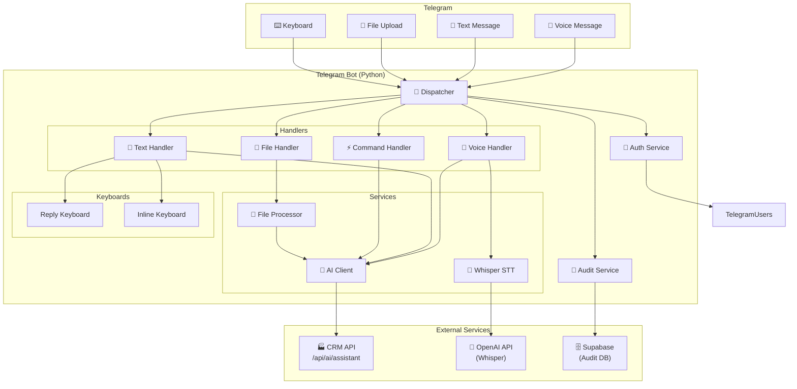
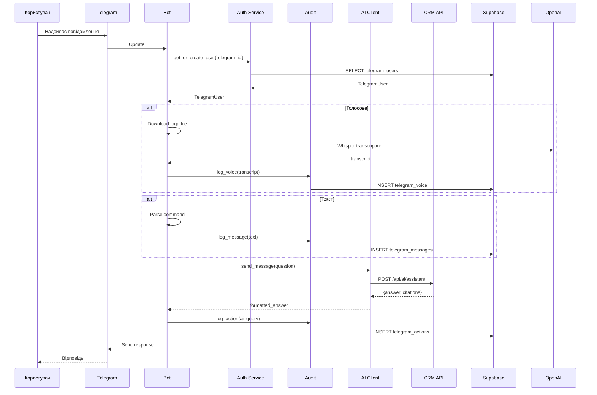
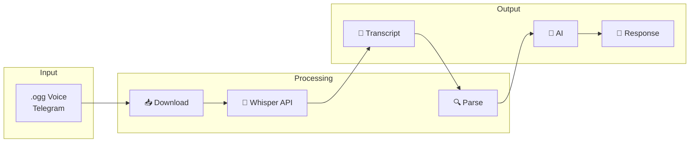
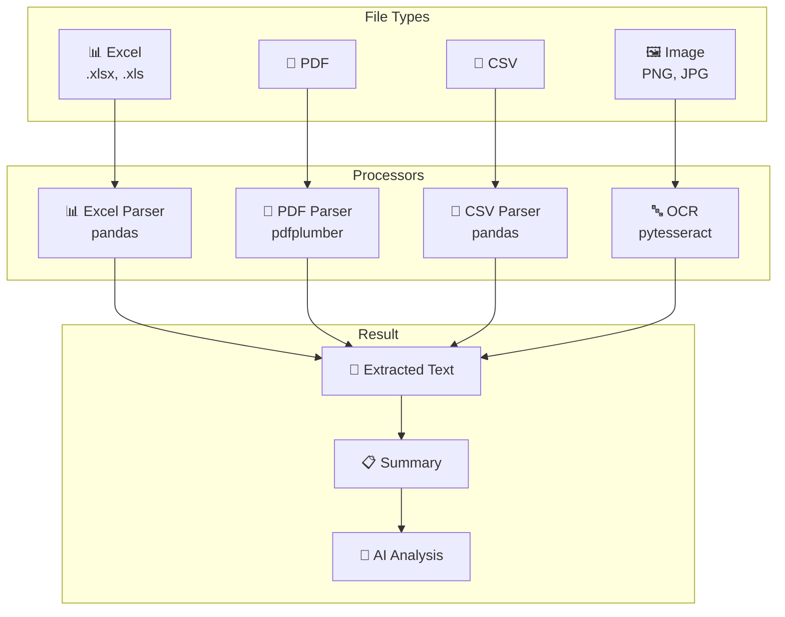
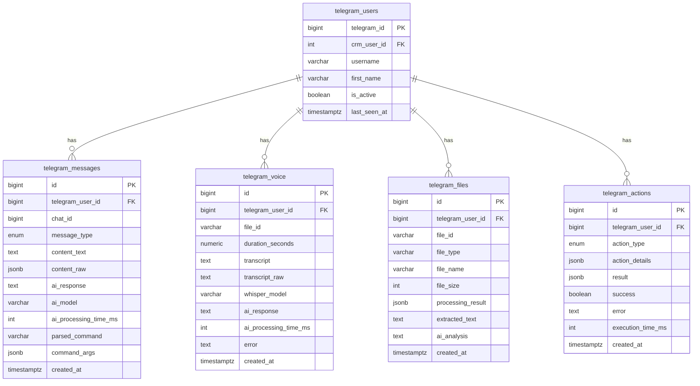
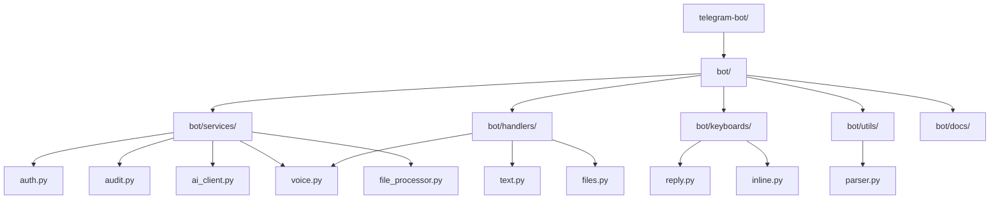
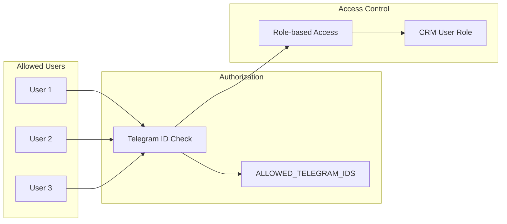

# Telegram Bot — Повна Архітектура

## Overview

Telegram бот для керування виробництвом "Швейка" через мобільний телефон з голосовим управлінням.

**Користувачі:** до 3 осіб з повним логуванням всіх дій.

---

## System Architecture



---

## Message Flow



---

## Voice Processing Flow



---

## File Processing Flow



---

## Database Schema



---

## Directory Structure



---

## Audit Logging

### What is Logged

| Event | Details Stored |
|-------|----------------|
| **Messages** | Full text (including punctuation), timestamp, type |
| **Voice** | Transcript (verbatim), duration, Whisper model |
| **Files** | File name, type, size, extracted text |
| **Actions** | Type, parameters, result, execution time |
| **AI Responses** | Full response text, model, processing time |

### Tables

| Table | Purpose |
|-------|---------|
| `telegram_messages` | All messages with AI responses |
| `telegram_voice` | Voice transcription records |
| `telegram_files` | File processing records |
| `telegram_actions` | Action audit (task creation, etc.) |
| `telegram_users` | User mapping |
| `telegram_sessions` | Session tracking |

---

## Security



### Authorization Flow

1. User sends message
2. Extract `telegram_id` from update
3. Check if `telegram_id` in `ALLOWED_TELEGRAM_IDS`
4. Get or create `telegram_users` record
5. Map to `crm_user_id` for CRM access
6. Log all activity to audit tables

---

## Deployment

### Environment Variables

```bash
TELEGRAM_BOT_TOKEN=xxx
CRM_URL=https://crm.example.com
CRM_API_KEY=xxx
OPENAI_API_KEY=sk-xxx
SUPABASE_URL=https://xxx.supabase.co
SUPABASE_KEY=xxx
ALLOWED_TELEGRAM_IDS=123,456,789
```

### Run

```bash
cd telegram-bot
pip install -r requirements.txt
cp .env.example .env
python -m bot.main
```

### Docker (Optional)

```dockerfile
FROM python:3.11-slim
WORKDIR /app
COPY requirements.txt .
RUN pip install -r requirements.txt
COPY . .
CMD ["python", "-m", "bot.main"]
```

---

## Version History

| Version | Date | Changes |
|---------|------|---------|
| 1.0.0 | 2026-04-18 | Initial implementation |
| 1.1.0 | 2026-04-18 | Added voice processing, file handling |
| 1.2.0 | 2026-04-18 | Added comprehensive audit logging |

---

## Notes

- All text is logged including punctuation (commas, periods)
- Voice transcripts are stored verbatim from Whisper
- File contents are partially stored for audit
- AI responses are fully logged
- Sessions are tracked with message/action counts