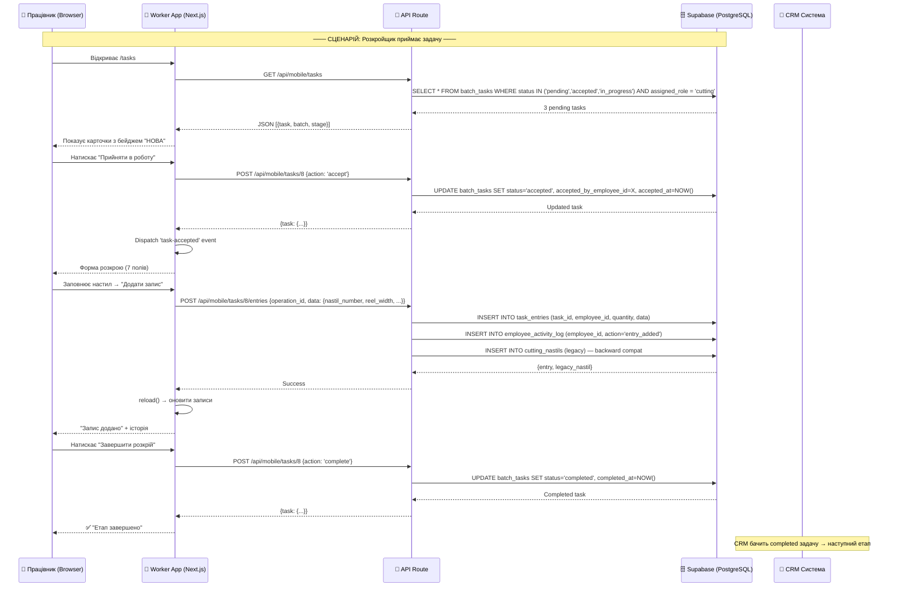
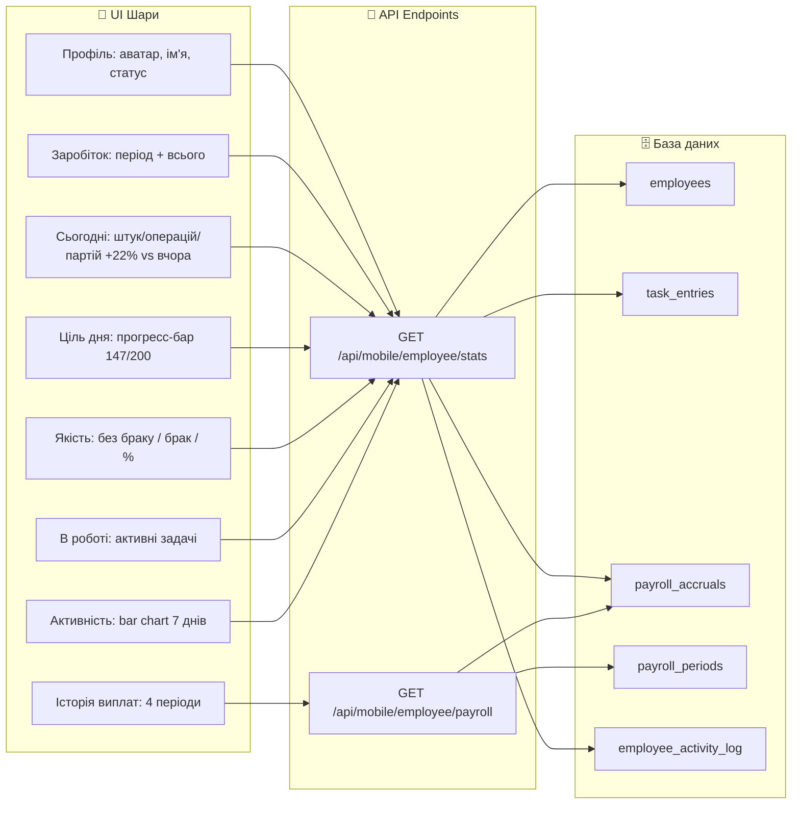

# Worker App — Архітектура проекту

> Швейний цех: мобільний додаток для працівників (Next.js 15 + Supabase)

---

## 1. Clean Architecture — Шарова структура

```mermaid
graph TB
    subgraph "🟢 Layer 1: Entities"
        E1[(employees)]
        E2[(batch_tasks)]
        E3[(task_entries)]
        E4[(production_batches)]
        E5[(production_stages)]
        E6[(stage_operations)]
        E7[(payroll_accruals)]
        E8[(payroll_periods)]
        E9[(employee_activity_log)]
        E10[(cutting_nastils)]
    end

    subgraph "🔵 Layer 2: Use Cases (API Routes)"
        UC1[POST /api/mobile/tasks/[id] — accept/complete]
        UC2[POST /api/mobile/tasks/[id]/entries — додати запис]
        UC3[GET  /api/mobile/tasks — список задач]
        UC4[GET  /api/mobile/employee/stats — статистика]
        UC5[GET  /api/mobile/employee/payroll — зарплата]
        UC6[POST /api/mobile/tasks — авто-створення задачі]
        UC7[GET  /api/mobile/notifications/count — сповіщення]
        UC8[GET  /api/mobile/batches/[id]/pipeline — конвеєр]
    end

    subgraph "🟡 Layer 3: Interface Adapters (Components)"
        IA1[📱 tasks/page.tsx — список]
        IA2[📱 tasks/[id]/page.tsx — деталі + форми]
        IA3[📱 profile/page.tsx — особистий кабінет]
        IA4[📱 profile/settings/page.tsx — налаштування]
        IA5[📱 login/page.tsx — вхід]
        IA6[📱 layout.tsx — навігація + дзвінок]
    end

    subgraph "⚪ Layer 4: Frameworks & Drivers (External)"
        F1[Next.js 15 — App Router]
        F2[Supabase — PostgreSQL]
        F3[Tailwind CSS + Material Symbols]
        F4[JWT Auth — cookie: mes_worker_token]
        F5[Web Push Notifications]
    end

    F1 --> IA1
    F1 --> IA2
    F1 --> IA3
    F1 --> IA4
    F1 --> IA5
    F1 --> IA6

    IA1 --> UC3
    IA2 --> UC1
    IA2 --> UC2
    IA3 --> UC4
    IA3 --> UC5
    IA6 --> UC7

    UC1 --> E2
    UC1 --> E3
    UC2 --> E3
    UC2 --> E9
    UC3 --> E2
    UC3 --> E4
    UC4 --> E1
    UC4 --> E3
    UC4 --> E7
    UC4 --> E9
    UC5 --> E7
    UC5 --> E8
    UC6 --> E2
    UC7 --> E2

    E2 -.-> E4
    E2 -.-> E5
    E2 -.-> E6
    E3 -.-> E2
    E3 -.-> E6
    E7 -.-> E8
    E7 -.-> E1
    E9 -.-> E1
```

---

## 2. Потік даних: Від прийняття задачі до завершення



---

## 3. Автоматичне створення задачі (batch → task)

```mermaid
flowchart TD
    A[CRM створює партію П-234] --> B[batch_tasks: жодного запису]
    B --> C[Працівник відкриває /batches/234]
    C --> D[Натискає на операцію 'Розкрой']
    D --> E{batch_tasks існує?}
    E -->|Так| F[redirect → /tasks/{id}]
    E -->|Ні| G[POST /api/mobile/tasks<br/>batch_id + stage_code]
    G --> H{stage_code = assigned_role?}
    H -->|Ні| I[403 Forbidden]
    H -->|Так| J[INSERT batch_tasks status='pending']
    J --> K[redirect → /tasks/{newId}]
    K --> F
    F --> L[Працівник бачить задачу]
```

---

## 4. Архітектура особистого кабінету (/profile)



---

## 5. Технологічний стек

| Шар | Технологія | Версія | Призначення |
|-----|-----------|--------|-------------|
| Framework | Next.js 15 | 15.1.11 | App Router, SSR, SSG |
| UI | React 19 | 19.0.0 | Компоненти, hooks |
| Стилі | Tailwind CSS | 3.4.1 | Utility-first CSS |
| Іконки | Material Symbols | latest | Google Icons |
| Шрифт | Inter | latest | next/font/google |
| База даних | Supabase (PostgreSQL) | latest | Хмарна + VPS |
| Auth | JWT (jose) | 6.2.2 | Cookie-based sessions |
| Валідація | Zod | 4.3.6 | Схеми даних |
| Lint | ESLint + Next.js | 9.x | Статичний аналіз |
| Типи | TypeScript | 5.x | Типобезпека |
| Деплой | Vercel / Self-hosted | — | Production |

---

## 6. Структура файлів (Clean Architecture)

```
worker-app/
├── src/
│   ├── app/                          # Layer 4: Framework (Next.js pages)
│   │   ├── (auth)/login/             #   — Аутентифікація
│   │   ├── (worker)/                 #   — Основний інтерфейс
│   │   │   ├── tasks/page.tsx        #     Список задач + бейдж НОВА
│   │   │   ├── tasks/[id]/page.tsx   #     Деталі + форми + валідація
│   │   │   ├── profile/page.tsx      #     Особистий кабінет
│   │   │   ├── profile/settings/     #     Налаштування (PIN, тема, вихід)
│   │   │   ├── batches/[id]/page.tsx #     Конвеєр партії
│   │   │   └── layout.tsx            #     Навігація + колокольчик
│   │   └── api/mobile/               # Layer 3: Interface Adapters
│   │       ├── tasks/route.ts        #   POST: авто-створення задачі
│   │       ├── tasks/[id]/route.ts   #   POST: accept/complete
│   │       ├── tasks/[id]/entries/   #   POST: додати запис
│   │       ├── employee/stats/       #   GET: статистика
│   │       ├── employee/payroll/     #   GET: історія виплат
│   │       └── notifications/count/  #   GET: кількість сповіщень
│   ├── components/                   # Layer 2: Use Cases helpers
│   │   ├── ThemeProvider.tsx
│   │   ├── StageHeader.tsx
│   │   ├── EntryHistory.tsx
│   │   ├── QuantityForm.tsx
│   │   └── PackagingForm.tsx
│   ├── hooks/                        # Reusable logic
│   │   └── useNotificationCount.ts   #   Polling 30s + browser notify
│   └── lib/                          # Layer 1: Entities helpers
│       ├── supabase.ts               #   Singleton Supabase client
│       ├── auth.ts                   #   JWT sign/verify
│       ├── stageConfig.ts            #   Конфіги етапів
│       └── sizeVariants.ts           #   Розмірні сітки
├── docs/                             # Документація
│   └── ARCHITECTURE.md               #   Цей файл
├── public/                           # Static assets
│   └── sw.js                         #   Service Worker (Push)
└── tailwind.config.ts                # Design tokens
```

---

## 7. Правила архітектури (Clean Architecture)

| Правило | Опис |
|---------|------|
| **Dependency Rule** | Залежності йдуть всередину. UI → API → DB. DB нічого не знає про UI. |
| **Single Responsibility** | Кожен файл = одна задача. `tasks/[id]/page.tsx` = тільки UI задачі. |
| **API as Use Cases** | API роути = use cases. Кожен endpoint = одна бізнес-операція. |
| **No Business Logic in UI** | Розрахунок quantity = `quantity_per_nastil × size_count` робиться в API, не в UI. |
| **Defensive Programming** | API завжди перевіряє роль, статус задачі, належність операції. |
| **Idempotent Operations** | POST `/api/mobile/tasks` повертає існуючу задачу якщо вона вже є. |
