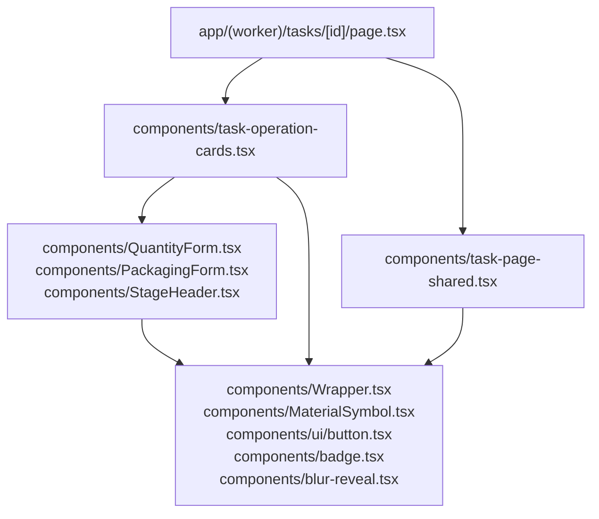
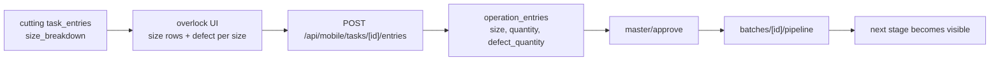

# UI Boundary and Component Ownership

This document records the UI refactor rule for the worker app:

- layout belongs outside the component
- visual styling belongs inside the component
- external code may only choose semantic modes such as `variant`, `size`, `tone`, `state`, and `disabled`
- `Wrapper` is the only approved way to manage layout concerns such as direction, gap, padding, margin, flex, grid, alignment, and positioning

## Component Boundary

## Ownership Rules

| Layer | Responsibility | Allowed |
|---|---|---|
| Page | Orchestration only | Data loading, routing, choosing components |
| Shared component | Reusable UI assembly | Business-aware composition, no page-local styling overrides |
| Visual component | Self-contained look and feel | Internal colors, borders, spacing, icons, states |
| Wrapper | Layout only | Direction, gap, padding, margin, flex, grid, alignment, positioning |

## Concrete Refactor Notes

- `Wrapper.tsx` is a layout primitive, not a cosmetic override point.
- `MaterialSymbol.tsx` owns icon rendering and tone logic.
- `task-page-shared.tsx` holds reusable field and queue UI pieces.
- `task-operation-cards.tsx` owns operation card rendering and modal composition.
- `OverlockOperationCard.tsx` owns the size-grid entry UI for overlock and enforces the cutting limit per size.
- `button.tsx`, `badge.tsx`, and `blur-reveal.tsx` no longer accept external cosmetic overrides.
- `tasks/[id]/page.tsx` now acts as an orchestrator rather than a local component factory.

## Overlock Flow

The overlock screen is not a free-form quantity box. It is a constrained per-size form that uses the cutting breakdown as the upper bound and persists defect quantities per size into Supabase.

## Rule of Thumb

If a prop changes how the component looks, it belongs inside the component as an explicit semantic variant.

If a prop only changes where the component sits relative to other elements, it belongs in `Wrapper` or the parent layout.
