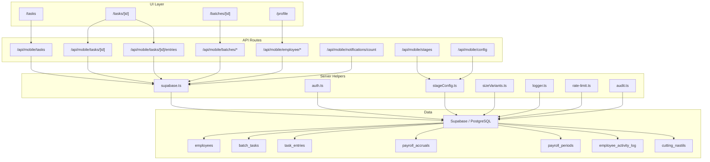

# Data and API Map

This map shows how routes connect to API handlers and data helpers.

## Contract rule

- UI refactors do not change the API contract.
- OpenAPI documents the wire format, not component composition.
- `task_entries` is the canonical execution log.
- `cutting_nastils` remains a legacy mirror where required.

## Data rule

- Reading and writing shop-floor data happens through server-side helpers.
- Route handlers own use-case orchestration.
- `src/lib/*` owns connection, validation, audit, and rate-limiting helpers.
