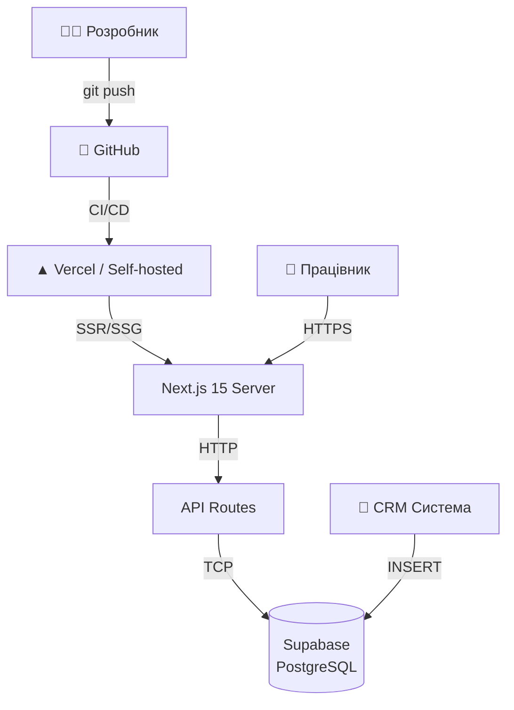

# Інфраструктура

---

## Деплой

## Середовища

| Параметр | Development | Production |
|---------|:-----------:|:----------:|
| **URL** | `localhost:3005` | Домен деплою |
| **Node.js** | 20+ | 20+ LTS |
| **Database** | Supabase (віддалений) | Supabase (VPS) |
| **Auth** | JWT cookie | JWT cookie (HttpOnly) |
| **SSL** | — | Let's Encrypt |
| **Port** | 3005 | 3000+ (nginx reverse proxy) |

## Змінні оточення

| Змінна | Опис | Приклад | Обов'язкова |
|--------|------|---------|:-----------:|
| `NEXT_PUBLIC_SUPABASE_URL` | URL Supabase проекту | `https://abc.supabase.co` | ✅ |
| `NEXT_PUBLIC_SUPABASE_ANON_KEY` | Публічний ключ | `eyJ...` | ✅ |
| `SUPABASE_SERVICE_ROLE_KEY` | Сервісний ключ (тільки сервер) | `eyJ...` | ✅ |
| `JWT_SECRET` | Секрет для JWT підпису | `random-string-32` | ✅ |

## База даних

| Компонент | Значення |
|-----------|---------|
| **СУБД** | PostgreSQL 15+ |
| **Провайдер** | Supabase (self-hosted на VPS) |
| **Схеми** | `public` (користувачі, audit) + `shveyka` (виробництво) |
| **Підключення** | Через `@supabase/supabase-js` (REST + WebSocket) |
| **Пул з'єднань** | Вбудований Supabase PgBouncer |

## Логіка кешування

| Шар | Стратегія | TTL |
|-----|----------|-----|
| API `GET /stages` | Cache-Control header | 1 год + stale-while-revalidate 24 год |
| API `GET /config` | Cache-Control header | 1 год + stale-while-revalidate 24 год |
| API `GET /tasks` | no-store (динамічні дані) | — |
| API `GET /employee/stats` | no-store (динамічні дані) | — |
| Browser static assets | Next.js immutable | До деплою |
| Browser page data | no-store (кожне оновлення) | — |

## Моніторинг

| Метрика | Як відстежується |
|---------|-----------------|
| **Помилки API** | console.error + Supabase logs |
| **Час відповіді** | Vercel Analytics / self-hosted |
| **Кількість користувачів** | `employee_activity_log` |
| **Розмір БД** | Supabase dashboard |

## Безпека

| Захід | Реалізація |
|-------|-----------|
| **Аутентифікація** | JWT cookie, HttpOnly, SameSite=Strict |
| **Авторизація** | Перевірка ролі в кожному API endpoint |
| **Валідація** | Zod схеми для вхідних даних |
| **SQL Injection** | Параметризовані запити (Supabase client) |
| **XSS** | React автоматичне екранування |
| **CORS** | Next.js за замовчуванням (same-origin) |
