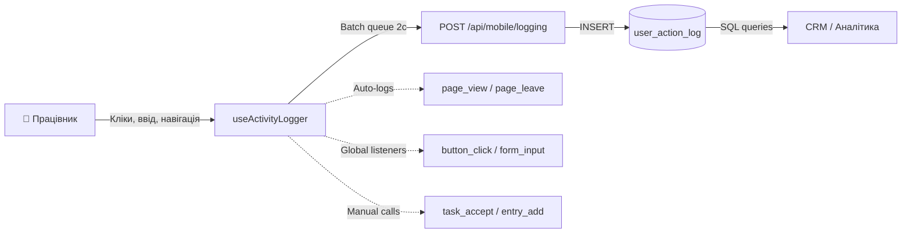

# Система логирования Worker App

> Полный аудит всех действий пользователя

---

## Архитектура



## Компоненты

| Компонент | Файл | Назначение |
|-----------|------|-----------|
| **DB Schema** | `docs/schemas/user_action_log.sql` | SQL таблица + индексы |
| **API** | `src/app/api/mobile/logging/route.ts` | Приём batch логов |
| **Hook** | `src/hooks/useActivityLogger.ts` | Клиентский сборщик |
| **Layout** | `src/app/(worker)/layout.tsx` | Активация хука + лог темы/выхода |
| **Login** | `src/app/(auth)/login/page.tsx` | Логин успех/неудача |
| **Task Detail** | `src/app/(worker)/tasks/[id]/page.tsx` | accept/complete/entry_add |

## Что логируется автоматически

| Событие | Триггер | Данные |
|---------|---------|--------|
| `page_view` | Смена URL | page_path, page_title |
| `page_leave` | Уход со страницы | page_path, time_on_page_ms |
| `button_click` | Клик по `<button>` | action_label, target_element |
| `navigation_click` | Клик по `<a>` | action_label, target_element |
| `form_input` | Ввод в `<input>` (debounce 500ms) | target_element, input_data |
| `form_submit` | Отправка формы | target_element |

## Что логируется вручную

| Событие | Где вызывается | Данные |
|---------|---------------|--------|
| `login_success` | login/page.tsx | employee_number |
| `login_fail` | login/page.tsx | employee_number |
| `logout` | layout.tsx | — |
| `theme_change` | layout.tsx | previous_value, new_value |
| `task_accept` | tasks/[id]/page.tsx | task_id, batch_id, stage_code |
| `task_complete` | tasks/[id]/page.tsx | task_id, batch_id, stage_code |
| `entry_add` | tasks/[id]/page.tsx | task_id, batch_id, stage_code, input_data |

## Оптимизации

| Механизм | Описание |
|----------|---------|
| **Batching** | Логи копятся в очереди, отправляются каждые 2 секунды |
| **Debounce** | form_input debounce 500ms на каждый элемент |
| **sendBeacon** | При unload страницы — navigator.sendBeacon (не блокирует) |
| **Keepalive** | fetch с keepalive: true для фоновой отправки |
| **Cap 100** | Максимум 100 записей за один запрос |
| **Fire-and-forget** | Ошибка логирования НЕ ломает приложение |

## Примеры записей в БД

```sql
-- Працівник увійшов
INSERT INTO shveyka.user_action_log (employee_id, session_id, action_type, action_label, page_path, input_data)
VALUES (42, 'uuid-...', 'login_success', '', '/login', '{"employee_number":"042"}');

-- Відкрив список задач
INSERT INTO shveyka.user_action_log (employee_id, session_id, action_type, page_path, page_title)
VALUES (42, 'uuid-...', 'page_view', '/tasks', 'Завдання');

-- Натиснув задачу
INSERT INTO shveyka.user_action_log (employee_id, session_id, action_type, action_label, target_element, page_path)
VALUES (42, 'uuid-...', 'card_click', 'П-234 Футболка базова', 'task-card-8', '/tasks');

-- Прийняв задачу
INSERT INTO shveyka.user_action_log (employee_id, session_id, action_type, page_path, task_id, batch_id, stage_code)
VALUES (42, 'uuid-...', 'task_accept', '/tasks/8', 8, 234, 'cutting');

-- Ввів кількість (debounced)
INSERT INTO shveyka.user_action_log (employee_id, session_id, action_type, action_label, target_element, input_data, page_path, task_id)
VALUES (42, 'uuid-...', 'form_input', 'Ввод: quantity_per_nastil', 'quantity_per_nastil', '{"quantity_per_nastil":"21"}', '/tasks/8', 8);

-- Додав запис
INSERT INTO shveyka.user_action_log (employee_id, session_id, action_type, action_label, page_path, task_id, batch_id, stage_code, input_data)
VALUES (42, 'uuid-...', 'entry_add', 'Додати запис: Настил', '/tasks/8', 8, 234, 'cutting', '{"nastil_number":"1","quantity_per_nastil":21,...}');

-- Пішов зі сторінки через 45 секунд
INSERT INTO shveyka.user_action_log (employee_id, session_id, action_type, page_path, time_on_page_ms)
VALUES (42, 'uuid-...', 'page_leave', '/tasks/8', 45230);
```

## Аналитика (примеры запросов)

```sql
-- Скільки часу працівник провів на сторінці задачі
SELECT page_path, AVG(time_on_page_ms) / 1000 as avg_seconds
FROM shveyka.user_action_log
WHERE employee_id = 42 AND action_type = 'page_leave'
GROUP BY page_path;

-- Скільки записів додав працівник за період
SELECT COUNT(*) as entries_added
FROM shveyka.user_action_log
WHERE employee_id = 42 AND action_type = 'entry_add'
  AND recorded_at >= NOW() - INTERVAL '7 days';

-- Які кнопки найчастіше натискає
SELECT action_label, COUNT(*) as clicks
FROM shveyka.user_action_log
WHERE employee_id = 42 AND action_type = 'button_click'
GROUP BY action_label
ORDER BY clicks DESC
LIMIT 10;

-- Середній час між відкриттям задачі і першим записом
SELECT AVG(EXTRACT(EPOCH FROM (t_entry.recorded_at - t_view.recorded_at))) as avg_seconds
FROM shveyka.user_action_log t_view
JOIN shveyka.user_action_log t_entry
  ON t_view.employee_id = t_entry.employee_id
  AND t_view.session_id = t_entry.session_id
  AND t_view.action_type = 'page_view'
  AND t_entry.action_type = 'entry_add'
  AND t_entry.recorded_at > t_view.recorded_at;
```

## Очистка старых логов

```sql
-- Cron job: раз в 30 дней
DELETE FROM shveyka.user_action_log
WHERE recorded_at < NOW() - INTERVAL '90 days';
```
