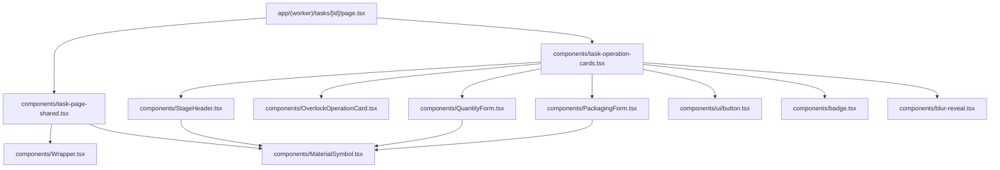

# Shared UI Components

This document tracks the reusable UI layer that was extracted during the cleanup.

## Component Map

## Reuse Rules

- Prefer an existing shared component before creating a page-local one.
- If a component can be shared, move it to `src/components/`.
- Do not use `className` or `style` as cosmetic override mechanisms.
- Use semantic props for visual variants and `Wrapper` for layout.
- Overlock uses the cutting size breakdown as its source of truth and records fact plus defect per size in Supabase.

## Current Registry

| Component | Responsibility |
|---|---|
| `Wrapper` | Layout-only composition helper |
| `MaterialSymbol` | Icon rendering with semantic tone and size |
| `StageHeader` | Stage title, progress, and plan quantity display |
| `QuantityForm` | Quantity entry UI for cutting and related flows |
| `OverlockOperationCard` | Overlock size-grid UI with per-size defect capture |
| `PackagingForm` | Packaging entry UI |
| `task-page-shared` | Shared field and entry-card building blocks |
| `task-operation-cards` | Task operation cards and modal composition |
| `button` | Internal button visual variants |
| `badge` | Internal badge visual variants |
| `blur-reveal` | Controlled reveal/animation primitive |
