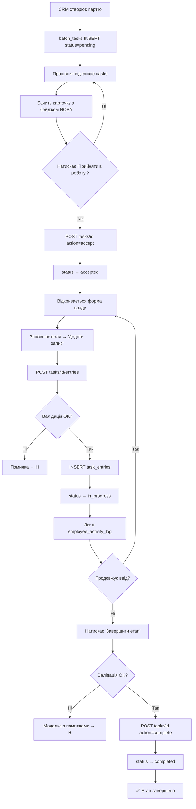
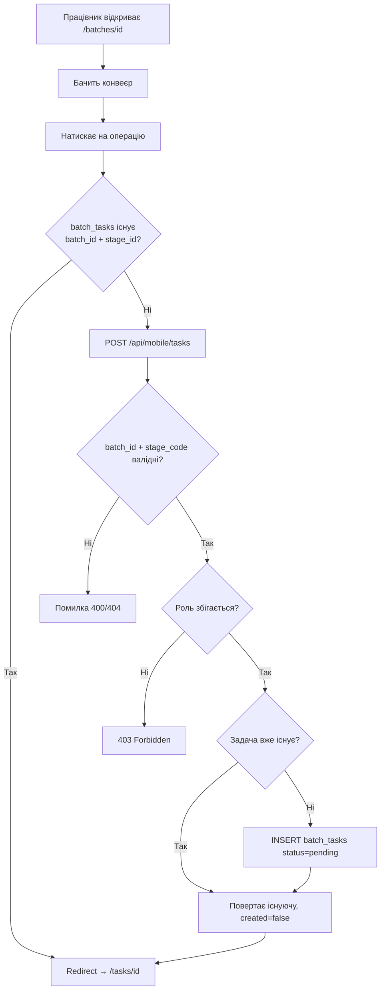
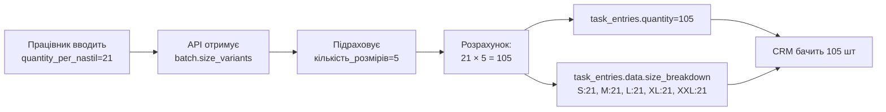
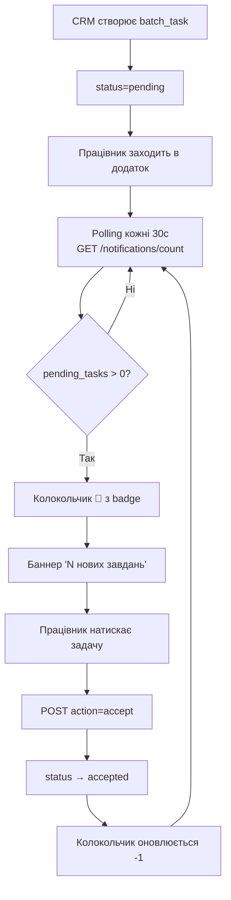
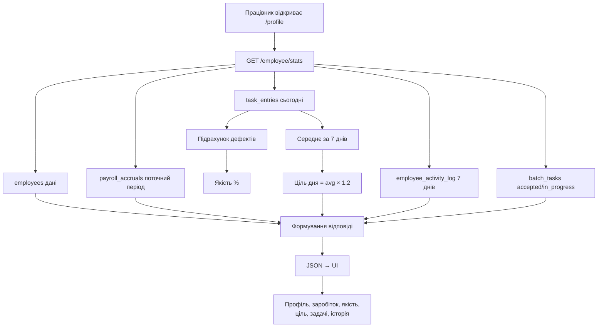
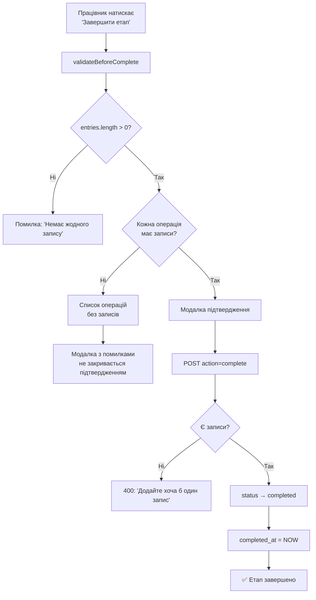

# Бізнес-процеси Worker App

---

## П1: Прийняття та виконання задачі

**Входи:** Працівник, задача в статусі `pending`
**Виходи:** Записи в `task_entries`, статус `completed`
**Учасники:** Працівник цеху, API, Supabase
**Тригери:** Створення задачі в CRM → `batch_tasks` INSERT

---

## П2: Автоматичне створення задачі

**Входи:** batch_id, stage_code
**Виходи:** batch_tasks запис або redirect на існуючу задачу
**Учасники:** Працівник, API, Supabase
**Тригери:** Натискання на операцію в конвеєрі партії

---

## П3: Розрахунок кількості для розкрою

**Входи:** quantity_per_nastil, batch.size_variants
**Виходи:** task_entries.quantity, task_entries.data.size_breakdown
**Обмеження:** Розрахунок ВИКОНУЄТЬСЯ на сервері, НЕ в UI
**Ризики:** Якщо size_variants порожній → quantity = quantity_per_nastil (без множення)

---

## П4: Сповіщення про нові задачі

**Періодичність polling:** 30 секунд
**Умова зникнення:** status ≠ pending
**Browser notifications:** При збільшенні count (якщо permission granted)

---

## П5: Особистий кабінет — збір статистики

**API:** `GET /api/mobile/employee/stats` + `GET /api/mobile/employee/payroll`
**Час відповіді:** ~200-500ms (6 паралельних запитів)
**Кешування:** Немає (дані змінюються в реальному часі)

---

## П6: Валідація завершення етапу

**Правило:** Неможливо завершити без записів
**Помилки:** Показують КОНКРЕТНІ операції без записів
**Серверна перевірка:** Дублює клієнтську валідацію
