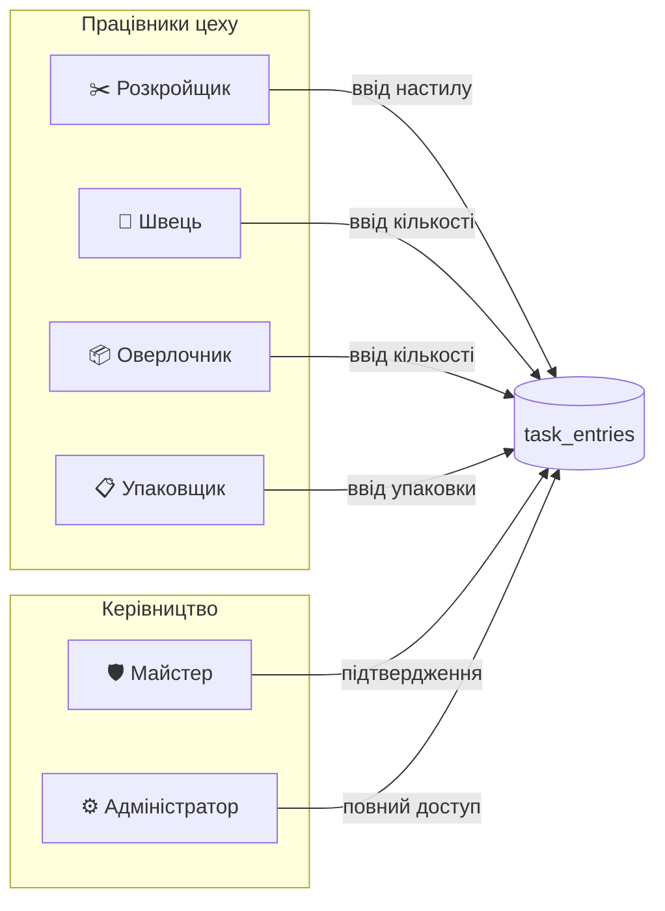
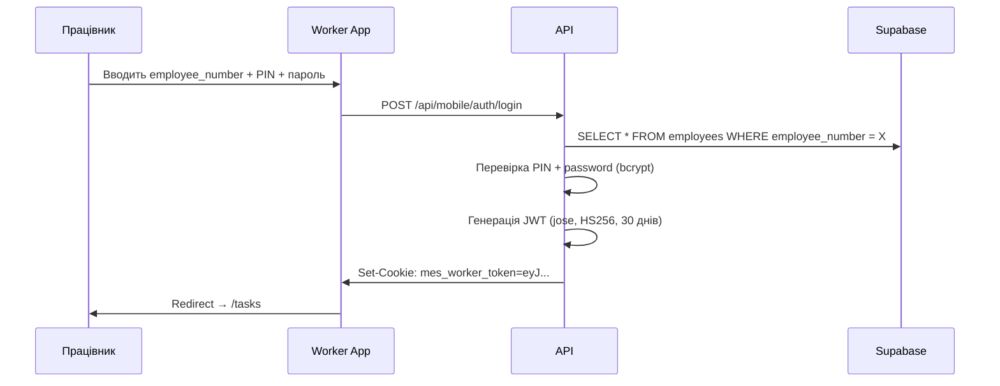

# Ролі та права доступу

> Хто що може робити в Worker App

---

## Матриця прав

## Детальна матриця

| Дія | Розкройщик | Швець | Оверлочник | Упаковщик | Майстер | Адмін |
|-----|:----------:|:-----:|:----------:|:---------:|:-------:|:-----:|
| Перегляд задач своєї ролі | ✅ | ✅ | ✅ | ✅ | ✅ | ✅ |
| Прийняття задачі | ✅ | ✅ | ✅ | ✅ | ✅ | ✅ |
| Ввід записів | ✅ | ✅ | ✅ | ✅ | ✅ | ✅ |
| Завершення етапу | ✅ | ✅ | ✅ | ✅ | ✅ | ✅ |
| Перегляд усіх партій | ❌ | ❌ | ❌ | ❌ | ✅ | ✅ |
| Призначення техпроцесу | ❌ | ❌ | ❌ | ❌ | ✅ | ✅ |
| Підтвердження записів | ❌ | ❌ | ❌ | ❌ | ✅ | ✅ |
| Створення партій | ❌ | ❌ | ❌ | ❌ | ✅ | ✅ |
| Управління працівниками | ❌ | ❌ | ❌ | ❌ | ❌ | ✅ |
| Перегляд payroll | ❌ | ❌ | ❌ | ❌ | ❌ | ✅ |

## Правила доступу

### 1. Фільтрація за роллю
- Worker бачить **тільки** задачі своєї ролі (`assigned_role = user.role`)
- Майстер бачить **усі** задачі
- Адмін бачить **усі** задачі + payroll + управління

### 2. Валідація ролі на сервері
- Кожен API endpoint перевіряє `stage.assigned_role === user.role`
- Якщо роль не збігається → `403 Forbidden`
- Виняток: `master` та `admin` мають доступ до всіх етапів

### 3. Прив'язка запису до працівника
- Кожен запис у `task_entries` містить `employee_id`
- Працівник бачить тільки **свої** записи
- Майстер бачить записи **усіх** працівників

## Аутентифікація

## Cookie

| Параметр | Значення |
|---------|---------|
| Name | `mes_worker_token` |
| Type | HttpOnly, SameSite=Strict |
| TTL | 30 днів |
| Algorithm | HS256 (jose) |
| Payload | `{ userId, username, role, employeeId }` |
