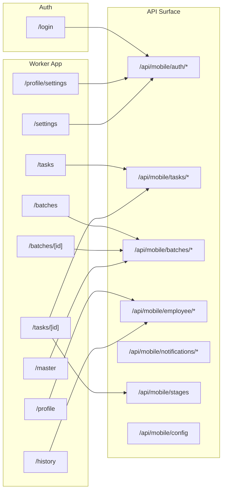

# Routes Map

This map shows the user-facing routes and how they group inside the app.

## Route ownership

- `/login` handles worker authentication.
- `/tasks` is the task inbox.
- `/tasks/[id]` is the execution screen.
- `/batches/[id]` is the production context and task entry point.
- `/profile` and `/profile/settings` cover worker stats and account settings.
- `/history` and `/master` are specialized operational views.

## Navigation rule

Navigation decides layout and orchestration only. Visual styling stays in the target component tree.
