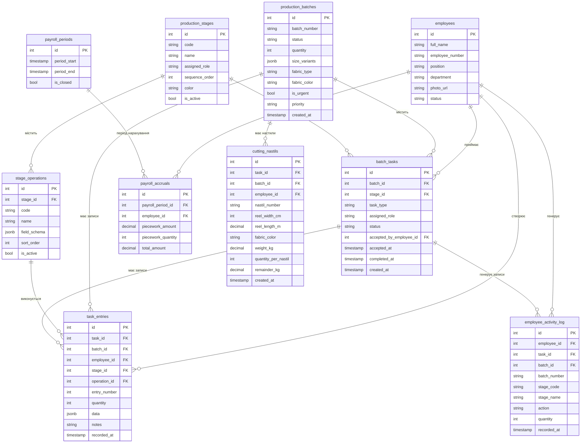

# Схеми даних

> Основні таблиці Supabase (schema: `shveyka`)

---

## ER Diagram



## Детальний опис таблиць

### batch_tasks

| Поле | Тип | Обов'язкове | Опис |
|------|-----|:-----------:|------|
| id | int | PK | ID задачі |
| batch_id | int | ✅ | Зв'язок з партією |
| stage_id | int | ✅ | Етап виробництва |
| task_type | string | ✅ | Код типу завдання |
| assigned_role | string | ✅ | Роль працівника |
| status | enum | ✅ | `pending / accepted / in_progress / completed / cancelled` |
| accepted_by_employee_id | int | ❌ | Хто прийняв |
| accepted_at | timestamp | ❌ | Коли прийнято |
| completed_at | timestamp | ❌ | Коли завершено |
| created_at | timestamp | ✅ | Дата створення |

**Business rules:**
- Створюється автоматично при першому зверненні до операції
- Статус змінюється: `pending → accepted → in_progress → completed`
- `pending` → `accepted` при натисканні "Прийняти в роботу"
- `accepted` → `in_progress` автоматично при першому записі
- `in_progress` → `completed` при натисканні "Завершити етап"

### task_entries

| Поле | Тип | Обов'язкове | Опис |
|------|-----|:-----------:|------|
| id | int | PK | ID запису |
| task_id | int | ✅ | Зв'язок із задачею |
| batch_id | int | ✅ | Зв'язок з партією |
| employee_id | int | ✅ | Хто виконав |
| stage_id | int | ✅ | Етап |
| operation_id | int | ✅ | Операція |
| entry_number | int | ✅ | Порядковий номер |
| quantity | int | ❌ | **Загальна кількість** (розрахована!) |
| data | jsonb | ✅ | Дані форми (field_schema) |
| notes | string | ❌ | Примітки |
| recorded_at | timestamp | ✅ | Час запису |

**Business rules:**
- Для розкрою: `quantity = quantity_per_nastil × кількість_розмірів`
- `entry_number` — автоінкремент в межах task_id + operation_id
- `data` містить різну структуру залежно від `field_schema` операції

### employees

| Поле | Тип | Обов'язкове | Опис |
|------|-----|:-----------:|------|
| id | int | PK | ID працівника |
| full_name | string | ✅ | ПІБ |
| employee_number | string | ✅ | Табельний номер |
| position | string | ❌ | Посада |
| department | string | ❌ | Відділ |
| photo_url | string | ❌ | URL фото |
| status | string | ✅ | `active / inactive` |

### payroll_accruals

| Поле | Тип | Обов'язкове | Опис |
|------|-----|:-----------:|------|
| id | int | PK | ID нарахування |
| payroll_period_id | int | ✅ | Період |
| employee_id | int | ✅ | Працівник |
| piecework_amount | decimal | ✅ | Сума (грн) |
| piecework_quantity | int | ✅ | Кількість (шт) |
| total_amount | decimal | ✅ | Загальна сума |

**Business rules:**
- Створюється/оновлюється при **підтвердженні** запису майстром
- `amount = quantity × rate` (rate з `stage_operations.base_rate`)
- Один запис на працівника за період

## JSONB схеми

### task_entries.data — Розкрой (nastil)

```json
{
  "nastil_number": "1",
  "reel_width_cm": 150,
  "reel_length_m": 50,
  "fabric_color": "чорний",
  "weight_kg": 12.5,
  "quantity_per_nastil": 21,
  "remainder_kg": 2.3,
  "size_breakdown": { "S": 21, "M": 21, "L": 21, "XL": 21, "XXL": 21 },
  "size_count": 5
}
```

### task_entries.data — Пошив/Оверлок/Прямострочка

```json
{
  "quantity_done": 42,
  "defect_quantity": 3,
  "notes": "Нитка кінчилася, замінив"
}
```

### task_entries.data — Упаковка

```json
{
  "quantity_packed": 50,
  "packaging_type": "individual",
  "notes": ""
}
```
