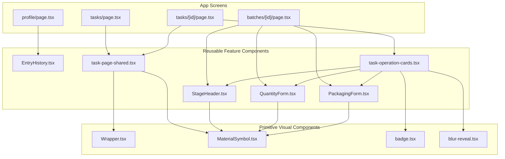

# UI Components Map

This map tracks the shared UI layer and the direction of reuse.

## Reuse policy

- Shared UI lives in `src/components/`.
- Page-local component factories are not allowed for stable UI.
- Cosmetic overrides from outside are not allowed.
- Layout is handled with `Wrapper` or parent composition.

## Current component roles

- `Wrapper` is the layout primitive.
- `MaterialSymbol` is the icon primitive.
- `StageHeader` renders stage identity and progress.
- `QuantityForm` and `PackagingForm` render domain-specific input UI.
- `task-page-shared` contains reusable field and queue blocks.
- `task-operation-cards` owns task card composition and modals.
