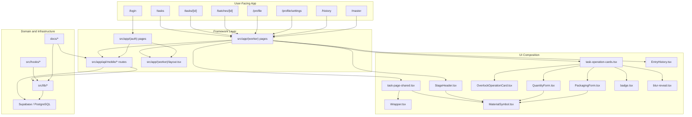

# Project Visual Map

This is the high-level map of the worker app. It shows where UI, shared components, API routes, and data boundaries live.

## What the map means

- Pages in `src/app/(worker)` are orchestrators, not style containers.
- Reusable visual behavior lives in `src/components/`.
- Runtime logic and server access live in `src/app/api/mobile/*` and `src/lib/*`.
- Documentation tracks both the architecture and the implementation boundary.

## Reading order

1. Start with the UI layer.
2. Follow the shared component layer.
3. Trace into API routes and `src/lib`.
4. Use the architecture docs and OpenAPI files for the formal contract.
